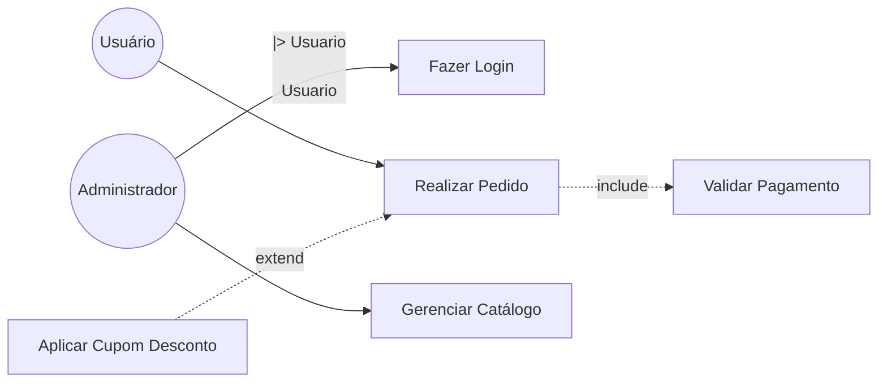
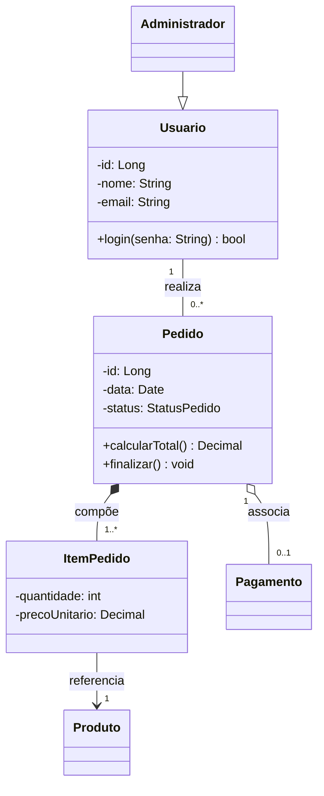
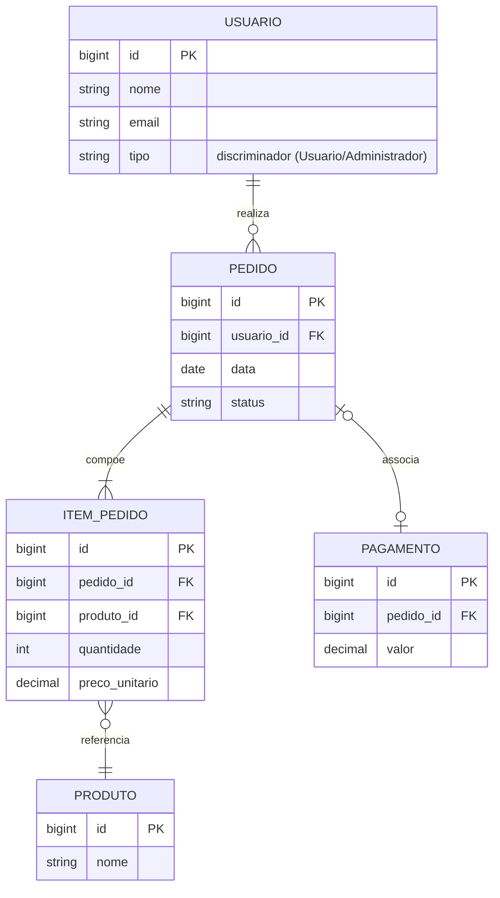
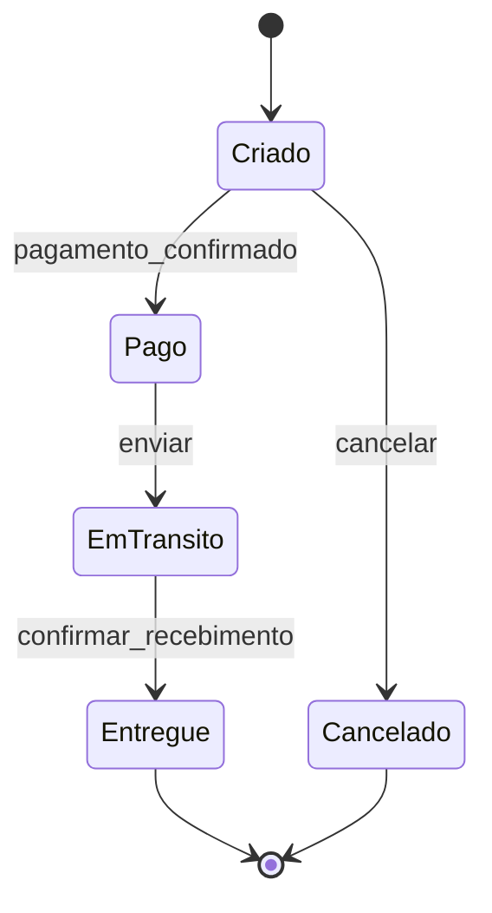
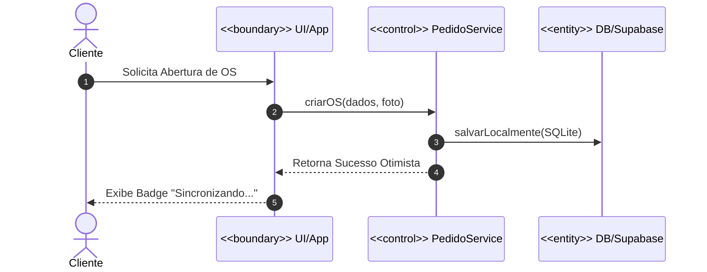

# Documento de Software (Análise e Projeto)

Guia produção de documento de software completo. Sempre seguir ordem abaixo — cada seção alimenta a próxima (requisito → ator/caso de uso → classe → diagrama de atividade).

Perguntar ao usuário domínio do sistema (o que o software faz) antes de começar, se ainda não souber. Sem domínio claro, não inventar requisitos genéricos demais — pedir contexto mínimo (usuários, principais funcionalidades, restrições).

Entregar documento final como arquivo Markdown no repo (ex: `docs/documento-software.md`) ou artifact, conforme pedido do usuário. Diagramas em Mermaid (renderizam nativo em artifacts e no GitHub).

## 1. Levantamento de Requisitos

Tabela de requisitos funcionais (RF) e não funcionais (RNF), numerados, rastreáveis.

**Requisito Funcional (RF)**: comportamento/função que sistema deve executar. Formato: `RFxx — Verbo + objeto + condição`.

**Requisito Não Funcional (RNF)**: qualidade, restrição, atributo (desempenho, segurança, usabilidade, disponibilidade, portabilidade, escalabilidade, conformidade legal). Formato: `RNFxx — categoria: descrição + critério mensurável`.

Template:

| ID | Descrição | Prioridade | Ator/Origem |
|----|-----------|-----------|-------------|
| RF01 | Sistema deve permitir que [ator] realize [ação] | Alta/Média/Baixa | Cliente |
| RNF01 | Tempo de resposta de login deve ser < 2s sob carga de 100 usuários simultâneos | Alta | Equipe |

Categorias RNF comuns: desempenho, segurança, usabilidade, confiabilidade, manutenibilidade, portabilidade, escalabilidade, compliance/legal.

Cada RF vira candidato a caso de uso na seção 2. Cada RNF vira restrição de arquitetura/design (ex: RNF de persistência → decide entidades persistentes na seção 3).

## 2. Diagrama de Casos de Uso

Elementos obrigatórios:
- **Atores**: papéis externos (pessoa, sistema externo, tempo/cron). Ator primário inicia caso de uso; secundário participa.
- **Herança de ator**: ator especializado herda casos de uso do ator geral (seta de generalização, triângulo vazado apontando pro ator geral). Ex: `Administrador --|> Usuário`.
- **`<<include>>`**: comportamento obrigatório, sempre executado, fatorado de múltiplos casos de uso (seta tracejada, direção caso-base → caso incluído).
- **`<<extend>>`**: comportamento opcional/condicional, insere-se em ponto de extensão do caso base (seta tracejada, direção caso-extensão → caso-base).

Regra prática pra não confundir include/extend: se comportamento é sempre necessário para o caso base completar → include. Se é opcional/alternativo, só ocorre em certa condição → extend.

Mermaid (usar `flowchart` já que Mermaid não tem use-case nativo, ou usar notação textual):



Se preferir notação PlantUML-style em texto simples dentro do documento (mais fiel ao padrão UML de caso de uso), oferecer como alternativa:

```
Ator: Cliente
Ator: Administrador (herda de Cliente)

UC01 Fazer Login
UC02 Realizar Pedido
  <<include>> UC03 Validar Pagamento
  <<extend>> UC04 Aplicar Cupom (ponto de extensão: antes de finalizar pedido)
UC05 Gerenciar Catálogo (Administrador)
```

Cada caso de uso relevante deve ter descrição textual: ator, pré-condição, fluxo principal, fluxos alternativos, pós-condição.

## 3. Diagrama de Classes

Extrair classes candidatas dos substantivos dos casos de uso e requisitos. Definir atributos, métodos, visibilidade (+public, -private, #protected), multiplicidade nas associações.

Relações a diferenciar:
- **Herança/Generalização**: `ClasseFilha --|> ClasseMae`. "É um".
- **Composição**: parte não existe sem o todo, ciclo de vida atrelado. Losango preenchido no lado do todo. `Pedido *-- ItemPedido`.
- **Agregação**: parte pode existir independente do todo, associação "tem um" fraca. Losango vazio. `Departamento o-- Funcionario`.
- **Associação simples**: relação sem posse forte, com multiplicidade.

Mermaid classDiagram:



**Persistência**: marcar quais classes são entidades persistentes (mapeadas em banco). Usar estereótipo `<<entity>>` ou anotação e indicar chave primária/estratégia (ex: ORM, tabela). Documentar ao lado do diagrama:

| Classe | Persistente? | Estratégia | Observação |
|--------|-------------|-----------|------------|
| Usuario | Sim | Tabela `usuario`, PK id | — |
| Pagamento | Sim | Tabela `pagamento`, FK pedido_id | Composição com Pedido |
| StatusPedido | Não (enum) | — | Valor embutido |

### 3.1 Diagrama Entidade-Relacionamento (DER)

Derivar direto da tabela de persistência acima: só entram as classes marcadas `Persistente? = Sim`. Enquanto diagrama de classes (seção 3) mostra visão de objeto (composição, agregação, herança, comportamento), o DER mostra visão relacional — tabela, chave primária (PK), chave estrangeira (FK), cardinalidade da FK.

Regra de conversão classe → tabela:
- Composição/agregação 1-N (`Pedido *-- ItemPedido`) → FK na tabela do lado "muitos", apontando pra PK do lado "um" (`item_pedido.pedido_id → pedido.id`).
- Associação N-N → tabela associativa própria com FK composta pras duas pontas (ex: `Produto` N-N `Categoria` vira tabela `produto_categoria`).
- Herança (`Administrador --|> Usuario`) → escolher estratégia e registrar no documento: tabela única com discriminador, tabela por subclasse com FK pra tabela mãe, ou tabela por classe concreta (todos os atributos duplicados). Default recomendado: tabela única com coluna `tipo` discriminadora, salvo RNF que exija outra.
- Value Object / enum (não persistente como entidade própria) → vira coluna(s) embutida(s) na tabela do dono, não tabela separada.

Mermaid `erDiagram`:



Notação de cardinalidade Mermaid: `||` exatamente um, `o|` zero ou um, `}o` zero ou muitos, `}|` um ou muitos. Conferir que toda cardinalidade aqui bate com a multiplicidade equivalente do diagrama de classes.

## 4. Diagramas Complementares de Análise e Projeto

Conforme a complexidade do sistema, incluir os diagramas abaixo.

### 4.1 Diagrama de Objetos
Instanciação concreta do Diagrama de Classes em um estado específico do sistema. Útil para ilustrar cenários de teste ou estruturas complexas em tempo de execução.

### 4.2 Diagrama de Estados (State Machine Diagram)
Obrigatório para entidades com ciclo de vida complexo (ex: Pedido: `Criado → Pago → Em Transito → Entregue / Cancelado`).



### 4.3 Padrão BCE (Boundary-Control-Entity)
Mapeamento das classes da análise em três categorias UML de análise:
- **Boundary (`<<boundary>>`)**: Interfaces com atores externos (Telas, APIs, Listeners).
- **Control (`<<control>>`)**: Lógica de negócio da aplicação, casos de uso, orquestradores.
- **Entity (`<<entity>>`)**: Dados do domínio e suas regras de negócio inerentes.

### 4.4 Diagrama de Sequência
Mostra a interação dinâmica entre objetos ao longo do tempo para realizar um Caso de Uso.



### 4.5 Diagrama de Atividades
Fluxo de trabalho (workflow) passo a passo de um processo de negócio, incluindo decisões paralelas e condicionais.

### 4.6 Diagrama de Componentes
Visão de arquitetura de alto nível, mostrando módulos, subsistemas, dependências e interfaces expostas/consumidas.

## 5. Diretrizes de Arquitetura e Implementação (DDD, Clean Arch & TDD)

Documentar os padrões arquiteturais que orientarão o código:
- **DDD (Domain-Driven Design)**: Identificação de Bounded Contexts, Aggregates, Entities e Value Objects.
- **Clean Architecture**: Separação clara em Camada de Apresentação/UI, Casos de Uso (Application), Domínio (Core) e Infraestrutura (DB, API, Storage).
- **TDD (Test-Driven Development)**: Estratégia de testes unitários para entidades e serviços, testes de integração para banco e mocks de API.
