# Documento de Especificação e Design de Software — App CJnet

> **Projeto**: Canal Digital de Autoatendimento e Suporte Offline-First  
> **Empresa**: CJnet Provedor de Internet  
> **Localização**: Coqueiral/MG  
> **Metodologia**: DDD, Clean Architecture, TDD (Test-Driven Development), Offline-First (SQLite + Supabase)  
> **Padrão de Documentação**: `software-design-doc` (UML / Mermaid)

---

## 1. Visão Geral e Levantamento de Requisitos

O **App CJnet** é o aplicativo móvel oficial de autoatendimento da CJnet para clientes residenciais e comerciais de Coqueiral/MG e região. O aplicativo resolve a sobrecarga do atendimento telefônico e presencial ao permitir a abertura de chamadas/Ordens de Serviço (OS) com anexação de fotos de equipamentos (roteadores/ONUs), acompanhamento em tempo real do suporte, verificação de cobertura via geolocalização e consulta aos planos de internet. Por ser voltado para uma região com conectividade por vezes instável, o aplicativo adota arquitetura **Offline-First**, permitindo consulta de dados em cache local e filas de sincronização resilientes.

### 1.1 Árvore de Ideias do Projeto (Mapa Mental de Visão Geral)

A **Árvore de Ideias** sintetiza a visão macro do **App CJnet**, organizando os pilares estratégicos da aplicação e desdobrando suas funcionalidades principais e requisitos estruturais, incluindo os módulos de **Autoatendimento**, **Técnicos**, **Administradores** e **Visitantes (na Tela de Login)**:

```mermaid
graph TD
    Root["<b>App CJnet</b><br/>Canal Digital de Autoatendimento, Suporte & Gestão"]

    Root --> P1["📱 <b>Autoatendimento do Cliente</b>"]
    P1 --> P1_1["Autoatendimento de Chamados<br/>(Sem Sinal, Queda, Lentidão)"]
    P1 --> P1_2["Autodiagnóstico Visual<br/>(Anexo de Foto da ONU/Roteador)"]
    P1 --> P1_3["Acompanhamento do Status da OS<br/>em Tempo Real"]
    P1 --> P1_4["Autoatendimento de Cadastro<br/>& Atualização do Endereço"]

    Root --> P2["💳 <b>Vitrine de Planos (Tela de Login)</b>"]
    P2 --> P2_1["Acesso Livre sem Autenticação"]
    P2 --> P2_2["Consulta de Velocidades & Preços"]
    P2 --> P2_3["Benefícios do Plano & Solicitação"]

    Root --> P3["👷 <b>Aba do Técnico de Campo</b>"]
    P3 --> P3_1["Lista de OSs Atribuídas ao Técnico"]
    P3 --> P3_2["Navegação GPS / Endereço do Cliente"]
    P3 --> P3_3["Check-in, Resolução & Foto do Reparo"]

    Root --> P4["👑 <b>Aba do Administrador / Gestor</b>"]
    P4 --> P4_1["Dashboard Geral de Atendimentos & Métricas"]
    P4 --> P4_2["Distribuição / Atribuição de OSs"]
    P4 --> P4_3["Gestão de Planos & Disparo de Avisos"]

    Root --> P5["⚡ <b>Resiliência & Offline-First</b>"]
    P5 --> P5_1["Cache Local SQLite<br/>(Leitura 100% Offline)"]
    P5 --> P5_2["Fila Assíncrona sync_queue<br/>(UUIDs temporários)"]
    P5 --> P5_3["Sincronização Automática<br/>(Backoff Exponencial)"]

    Root --> P6["🗺️ <b>Geolocalização & Rede</b>"]
    P6 --> P6_1["Mapa Interativo da Região<br/>(Coqueiral/MG e Arredores)"]
    P6 --> P6_2["Verificação de Cobertura GeoJSON"]
    P6 --> P6_3["Validação do Ponto de Instalação"]

    Root --> P7["🔒 <b>Segurança & UX Perfilada</b>"]
    P7 --> P7_1["Autenticação por Perfil<br/>(Cliente / Técnico / Admin)"]
    P7 --> P7_2["Segurança Supabase RLS"]
    P7 --> P7_3["UI Intuitiva & Acessível"]
```

#### Descrição dos Pilares da Árvore de Ideias:
1. **Autoatendimento do Cliente**: Empodera o assinante para resolver instabilidades de conexão de forma autônoma, abrindo chamados sem passar por filas telefônicas, enviando fotos das luzes do roteador para autodiagnóstico e gerenciando seu perfil e localização.
2. **Vitrine de Planos (Tela de Login)**: Permite que visitantes e futuros assinantes cliquem na tela inicial/login para explorar os planos de fibra óptica disponíveis (velocidades, valores e vantagens) sem precisar estar autenticado.
3. **Aba do Técnico de Campo**: Módulo exclusivo com visão em lista/mapa das ordens de serviço atribuídas ao técnico, guiando sua rota de atendimento e registrando o encerramento do chamado com foto do serviço finalizado.
4. **Aba do Administrador / Gestor**: Painel centralizado para a gerência da CJnet controlar filas de suporte, atribuir chamados para técnicos em campo, cadastrar/alterar planos comercializados e emitir alertas e comunicados gerais para a base de clientes.
5. **Resiliência & Offline-First**: Assegura a operabilidade completa do app mesmo em locais com sinal de internet oscilante ou indisponível.
6. **Geolocalização & Rede**: Permite consultar disponibilidade técnica de fibra óptica e validações de endereço em tempo real no mapa.
7. **Segurança & UX Perfilada**: Garante controle de acesso baseado em papéis (RBAC/RLS) para proteger dados sensíveis de acordo com o perfil do usuário logado.


### 1.2 Tabela de Requisitos Funcionais (RF)

| ID | Descrição | Prioridade | Ator/Origem |
|----|-----------|-----------|-------------|
| **RF01** | O sistema deve permitir que o cliente realize login/autenticação vinculando seu CPF/CNPJ ou e-mail ao cadastro ativo na CJnet, com sessão armazenada de forma segura no dispositivo. | Alta | Cliente |
| **RF02** | O sistema deve permitir que visitantes realizem pré-cadastro informando nome, CPF/CNPJ, endereço e telefone para solicitação de contrato de internet. | Média | Visitante |
| **RF03** | O sistema deve redirecionar automaticamente o usuário autenticado para a aba correta conforme seu papel: cliente → aba-cliente, técnico → aba-técnico, administrador → aba-administrador. | Alta | Sistema (AuthService) |
| **RF04** | O sistema deve permitir a abertura de uma nova Ordem de Serviço (OS) informando o tipo de problema (ex: sem sinal, lentidão, queda) e descrição. | Alta | Cliente |
| **RF05** | O sistema deve permitir tirar foto do roteador/ONU através da câmera do dispositivo e anexá-la à Ordem de Serviço aberta. | Alta | Cliente |
| **RF06** | O sistema deve gravar a OS e a foto localmente no dispositivo (offline-first) atribuindo um ID temporário (UUID) e enfileirando para sincronização. | Alta | Sistema |
| **RF07** | O sistema deve exibir o status atualizado das Ordens de Serviço abertas (ex: Pendente, Em Atendimento, Concluída) e o histórico completo de chamados encerrados do cliente logado. | Alta | Cliente |
| **RF08** | O sistema deve exibir no mapa interativo se a localização do cliente ou endereço informado está dentro da área de cobertura GeoJSON da CJnet. | Média | Cliente / Visitante |
| **RF09** | O sistema deve permitir que o cliente consulte e atualize seus dados cadastrais e localização da sua residência no mapa. | Média | Cliente |
| **RF10** | O sistema deve sincronizar automaticamente as ações pendentes (`sync_queue`) em segundo plano assim que a conectividade for restabelecida. | Alta | Sistema (SyncService) |
| **RF11** | O sistema deve permitir que visitantes e clientes consultem os planos de internet da CJnet (velocidades, preços e benefícios) diretamente através de um botão/atalho na tela de login, sem necessidade de autenticação. | Média | Visitante / Cliente |
| **RF12** | O sistema deve disponibilizar a **Aba do Técnico**, exibindo as Ordens de Serviço atribuídas ao técnico logado, mapa de rota até a residência do cliente e registro de encerramento com foto do reparo efetuado. | Alta | Técnico |
| **RF13** | O sistema deve disponibilizar a **Aba do Administrador**, fornecendo painel gerencial com indicadores de OSs (pendentes, em andamento, concluídas), atribuição de técnicos a chamados, gestão de planos e envio de notificações em massa. | Alta | Administrador |
| **RF14** | O sistema deve enviar notificações push para os clientes quando o status de uma OS for alterado pelo técnico ou administrador (ex: "Seu chamado está em atendimento"). | Média | Sistema / Administrador |
| **RF15** | O sistema deve permitir que o administrador filtre, busque e exporte relatórios de chamados por período, bairro e técnico responsável, diretamente pelo painel da Aba do Administrador. | Baixa | Administrador |


### 1.3 Tabela de Requisitos Não Funcionais (RNF)

| ID | Categoria | Descrição + Critério Mensurável | Prioridade |
|----|-----------|----------------------------------|-------------|
| **RNF01** | **Disponibilidade / Offline** | O aplicativo deve manter funcionalidade de leitura (OSs existentes, perfil e mapa offline) 100% acessível sem conexão à internet. | Alta |
| **RNF02** | **Desempenho** | A consulta e gravação local no banco de dados SQLite deve responder em tempo < 100ms no dispositivo móvel. | Alta |
| **RNF03** | **Segurança de Rede e Dados** | Toda comunicação com a nuvem deve utilizar HTTPS/TLS; as tabelas no Supabase devem possuir políticas rígidas de **Row Level Security (RLS)** restritas ao `auth.uid()`; e os tokens JWT de sessão devem ser armazenados exclusivamente via **`expo-secure-store`** (Keychain iOS / Android Keystore), nunca em `AsyncStorage` ou SQLite. | Alta |
| **RNF04** | **Usabilidade** | A interface deve ser otimizada para telas de dispositivos Android e iOS com botões grandes, alto contraste e linguagem simples, acessível para usuários de diferentes faixas etárias de cidade do interior. | Alta |
| **RNF05** | **Manutenibilidade** | A arquitetura do código deve seguir **Clean Architecture / TDD**, isolando completamente a camada de banco de dados SQLite (`src/db/`) da camada de API remota Supabase (`src/api/`). | Média |
| **RNF06** | **Confiabilidade** | O serviço de sincronização (`syncService`) deve implementar retentativas com backoff exponencial e garantir idempotência sem duplicação de chamados no backend. | Alta |
| **RNF07** | **Portabilidade** | O app deve ser construído sobre Expo (React Native) com suporte a navegação por arquivos (Expo Router) e suporte à execução universal em Android (mínimo API 26 / Android 8.0) e iOS (mínimo iOS 16). | Alta |
| **RNF08** | **Eficiência Energética** | A captura de geolocalização e fotos deve ser pontual, proibindo rastreamento de localização em segundo plano (*background location tracking*) para conservar bateria. | Média |
| **RNF09** | **Gestão de Mídia** | As fotos capturadas pelo cliente ou pelo técnico devem ser comprimidas para no máximo **1 MB** antes do upload para o Supabase Storage, garantindo desempenho adequado em conexões lentas (3G/4G de baixa intensidade). | Média |
| **RNF10** | **Controle de Acesso (RBAC)** | O sistema deve implementar controle de acesso baseado em papéis (*Role-Based Access Control*), garantindo que rotas, dados e funcionalidades da Aba do Técnico e da Aba do Administrador sejam completamente inacessíveis a usuários com papel `cliente`. | Alta |


---

## 2. Diagrama de Casos de Uso

### 2.1 Atores do Sistema
- **Cliente**: Usuário final cadastrado que utiliza o app para abrir Ordens de Serviço (OS), acompanhar o andamento e o histórico dos chamados e visualizar seu perfil.
- **Visitante / Não Logado**: Usuário que acessa o app para consultar a área de cobertura, explorar os **Planos de Internet** disponíveis na tela de login ou realizar pré-cadastro.
- **Técnico de Campo**: Usuário operacional da CJnet que acessa a **Aba do Técnico** para consultar a lista de OSs atribuídas a ele, navegar até o cliente e registrar o encerramento do chamado com foto do serviço prestado.
- **Administrador / Gestor**: Usuário gerencial da CJnet que acessa a **Aba do Administrador** para monitorar indicadores de suporte, atribuir ordens de serviço para técnicos, gerenciar planos de internet, filtrar relatórios e disparar notificações push em massa.
- **Supabase Auth / Postgres**: Sistema externo remoto de autenticação e banco de dados relacional.
- **SyncService (Cron/Event)**: Serviço em segundo plano que processa a fila local offline e dispara notificações push de status.
- **PushService**: Serviço de mensageria que entrega notificações push aos dispositivos dos clientes (ex: Expo Notifications / Firebase FCM).

### 2.2 Diagrama Mermaid de Casos de Uso

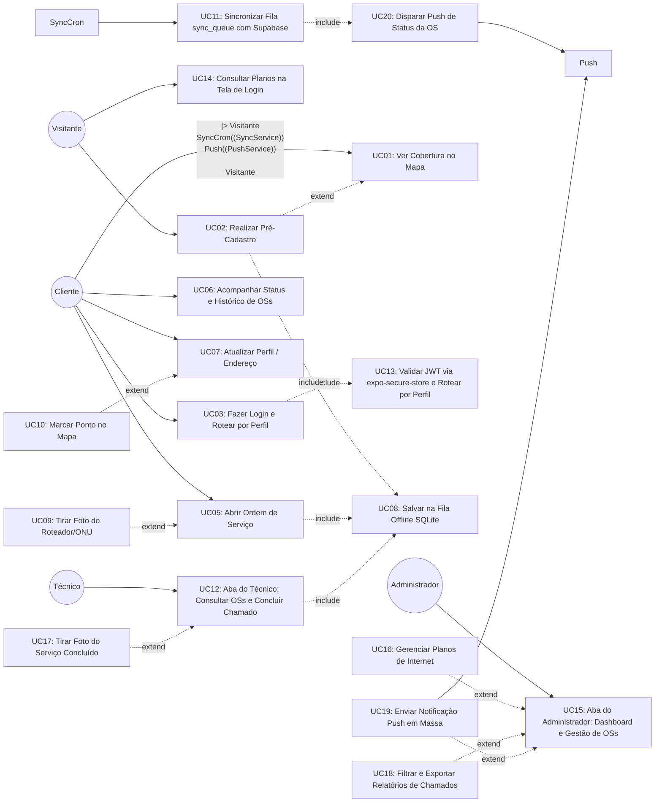

### 2.3 Especificação Textual dos Casos de Uso Principais

#### UC02: Realizar Pré-Cadastro
- **Ator Principal**: Visitante.
- **Pré-condição**: Nenhuma (acesso público).
- **Fluxo Principal**:
  1. O visitante acessa o app e na tela de login seleciona **"Quero ser cliente"**.
  2. O app exibe o formulário de pré-cadastro solicitando: nome completo, CPF/CNPJ, telefone e endereço.
  3. (Opcional) O visitante verifica a cobertura do endereço no mapa (`<<extend>> UC01`).
  4. O visitante confirma o envio. O app grava a solicitação no SQLite local e enfileira para envio ao Supabase (`<<include>> UC08`).
  5. O app exibe mensagem: **"Solicitação enviada! Nossa equipe entrará em contato."**
- **Fluxo Alternativo**:
  - *Offline*: O pré-cadastro fica salvo localmente e sincroniza quando a conexão for restabelecida.

#### UC03: Fazer Login e Rotear por Perfil
- **Ator Principal**: Cliente / Técnico / Administrador.
- **Pré-condição**: Nenhuma (tela de login).
- **Fluxo Principal**:
  1. O usuário informa e-mail (ou CPF) e senha na tela de login.
  2. O app autentica via Supabase Auth (HTTPS/TLS).
  3. Ao receber o token JWT, o app o salva de forma segura via **`expo-secure-store`** (Keychain/Android Keystore) — `<<include>> UC13`.
  4. O `authService` lê o campo `papel` do usuário (`cliente`, `tecnico` ou `admin`) e redireciona automaticamente:
     - `cliente` → **Aba do Cliente** `(tabs-cliente)`
     - `tecnico` → **Aba do Técnico** `(tabs-tecnico)`
     - `admin` → **Aba do Administrador** `(tabs-admin)`
- **Fluxo Alternativo**:
  - *Sessão cached*: Se já existe token válido no `expo-secure-store`, o usuário é redirecionado diretamente sem exibir o formulário de login.
  - *Credenciais inválidas*: O app exibe mensagem de erro e não salva nenhum dado.

#### UC05: Abrir Ordem de Serviço (OS)
- **Ator Principal**: Cliente.
- **Pré-condição**: Cliente logado ou com sessão em cache local.
- **Fluxo Principal**:
  1. O cliente navega até a aba `Suporte` e seleciona `Nova OS`.
  2. O cliente escolhe o tipo de problema (*Sem sinal*, *Lentidão*, *Queda constante*, *Mudança de endereço*).
  3. O cliente insere a descrição textual detalhada do problema.
  4. (Opcional) O cliente escolhe anexar foto (`<<extend>> UC09`).
  5. O cliente confirma o envio.
  6. O sistema gera um UUID local (`id_local`), grava na tabela local `ordens_servico` com `status = 'pendente'` e insere uma entrada na `sync_queue` (`<<include>> UC08`).
  7. A interface exibe a mensagem de sucesso otimista com um badge indicativo "Sincronizando...".
- **Fluxos Alternativos**:
  - *Dispositivo Online*: O `syncService` detecta a conexão e sincroniza imediatamente com o Supabase.
  - *Dispositivo Offline*: O OS fica em cache local até que a rede retorne.

#### UC06: Acompanhar Status e Histórico de OSs
- **Ator Principal**: Cliente.
- **Pré-condição**: Cliente logado.
- **Fluxo Principal**:
  1. O cliente acessa a aba `Meus Chamados`.
  2. O app exibe a lista de OSs **abertas** com badge de status em tempo real (Pendente, Em Atendimento).
  3. O cliente pode alternar para a aba **Histórico**, que lista todas as OSs com status `Concluída` ou `Cancelada`, com data de encerramento e observação do técnico.
  4. O cliente pode tocar em qualquer OS para ver os detalhes completos, incluindo a foto do reparo tirada pelo técnico.
- **Fluxo Alternativo**:
  - *Offline*: O app exibe os dados do cache SQLite local sem indicar atualização em tempo real.

#### UC09: Tirar Foto do Roteador/ONU (Ponto de Extensão em UC05)
- **Ator Principal**: Cliente.
- **Condição de Extensão**: Acionada quando o cliente clica em "Adicionar foto do equipamento" durante a abertura da OS.
- **Fluxo**:
  1. O app abre a câmera do dispositivo via `expo-image-picker`/`expo-camera`.
  2. O cliente tira a foto demonstrando os leds/luzes de status do equipamento.
  3. O app **comprime a imagem para no máximo 1 MB** antes de salvar (RNF09).
  4. O app salva o arquivo de imagem no armazenamento interno do app (`expo-file-system`) e grava o caminho local em `foto_local_path`.
  5. O upload binário para o Supabase Storage (`bucket: os-fotos`) é delegado para a fila de sincronização em segundo plano para não travar o envio do formulário textual.

#### UC12: Aba do Técnico — Atendimento e Encerramento de OS
- **Ator Principal**: Técnico de Campo.
- **Pré-condição**: Técnico autenticado no perfil `tecnico`.
- **Fluxo**:
  1. O técnico acessa a **Aba do Técnico** e visualiza a lista de Ordens de Serviço atribuídas ao seu usuário no dia.
  2. O técnico seleciona um chamado, abre a localização do cliente no mapa integrado e aciona a navegação GPS.
  3. Ao chegar no local, o técnico altera o status para `em_atendimento`.
  4. Após efetuar o reparo ou troca do roteador, o técnico registra a observação técnica, clica em "Concluir Atendimento" e tira a foto comprovando o serviço executado (`<<extend>> UC17`).
  5. O app salva os dados localmente e enfileira na `sync_queue` para sincronização com o Supabase (`<<include>> UC08`).
  6. Após a sincronização, o `SyncService` dispara a notificação push para o cliente informando a conclusão (`<<include>> UC20`).

#### UC14: Consultar Planos de Internet na Tela de Login
- **Ator Principal**: Visitante / Cliente.
- **Pré-condição**: Nenhuma (Acesso público na tela de boas-vindas/login).
- **Fluxo**:
  1. O usuário abre o aplicativo e, na tela de login, clica no botão ou card **"Conhecer Nossos Planos"**.
  2. O app carrega a lista de planos de fibra óptica disponíveis (com dados em cache local ou via Supabase em tempo real).
  3. O usuário visualiza velocidades (ex: 200 Mega, 400 Mega, 600 Mega), preços mensais e benefícios incluídos (Wi-Fi 6, suporte prioritário, etc.).
  4. O usuário pode clicar em **"Contratar / Solicitar Cobertura"**, sendo redirecionado para a checagem no mapa (`UC01`) ou tela de cadastro (`UC02`).

#### UC15: Aba do Administrador — Painel de Gestão e Notificações
- **Ator Principal**: Administrador / Gestor.
- **Pré-condição**: Usuário autenticado no perfil `admin`.
- **Fluxo**:
  1. O gestor acessa a **Aba do Administrador** e visualiza o dashboard com métricas de chamados (total abertos, tempo médio de atendimento, chamados pendentes por bairro de Coqueiral/MG).
  2. O gestor seleciona chamados pendentes e faz a atribuição direta para os técnicos de campo disponíveis.
  3. O gestor pode cadastrar novos planos de internet ou alterar valores/velocidades existentes (`<<extend>> UC16`), que atualizarão a vitrine da tela de login (`UC14`).
  4. O gestor pode criar e enviar um comunicado/aviso geral (ex: "Manutenção programada na rede da zona rural dia 10/09") para a base de clientes via notificação push no app (`<<extend>> UC19`).
  5. O gestor pode filtrar chamados por período, bairro ou técnico e exportar o relatório (`<<extend>> UC18`).

#### UC20: Disparar Notificação Push de Status da OS
- **Ator Principal**: Sistema (SyncService / PushService).
- **Pré-condição**: OS sincronizada com sucesso no Supabase e status alterado (`em_atendimento` ou `concluída`).
- **Fluxo**:
  1. Após confirmar o `INSERT`/`UPDATE` da OS no Supabase, o `SyncService` identifica a mudança de status.
  2. O sistema envia uma notificação push para o dispositivo do cliente vinculado à OS (ex: *"Seu chamado #1234 está Em Atendimento"*) via `PushService`.
  3. O cliente recebe a notificação no dispositivo, podendo tocar para abrir diretamente os detalhes da OS no app.


---

## 3. Diagrama de Classes e Estrutura de Dados

### 3.1 Diagrama de Classes de Domínio (UML)

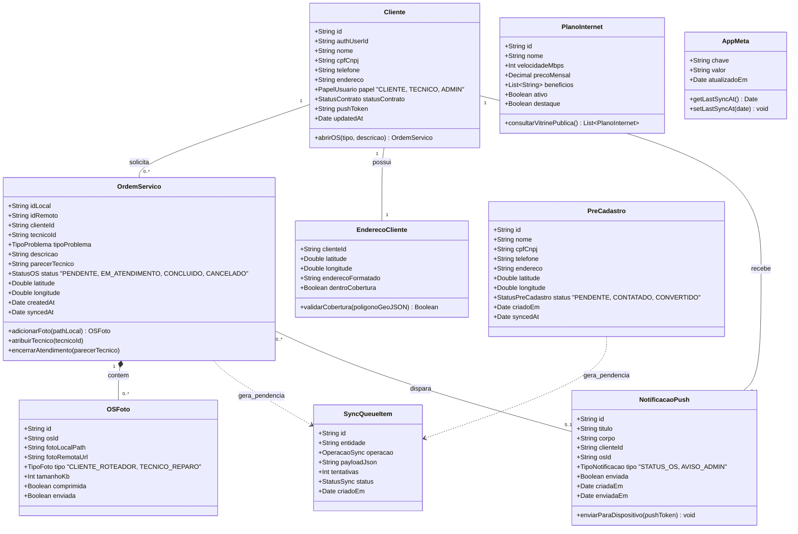

### 3.2 Tabela de Persistência e Estratégia Mapeada

| Classe | Persistente? | Estratégia Local (SQLite) | Estratégia Remota (Supabase Postgres) | Observação |
|--------|-------------|----------------------------|----------------------------------------|------------|
| `Cliente` | Sim | Tabela `clientes` | Tabela `public.clientes` | FK `auth_user_id → auth.users`, inclui colunas `papel` e `push_token` |
| `PlanoInternet` | Sim | Tabela `planos_internet` | Tabela `public.planos_internet` | Exibido na tela de login sem autenticação; gerenciado pelo Admin |
| `OrdemServico` | Sim | Tabela `ordens_servico` (PK `id_local` UUID) | Tabela `public.ordens_servico` (PK `id` BigInt/UUID) | Inclui `tecnico_id` (FK) e `parecer_tecnico` para encerramento |
| `OSFoto` | Sim | Guardado em `foto_local_path` + campo `tamanho_kb` e `comprimida` | Bucket Supabase Storage `os-fotos` + Tabela `public.os_fotos` | Comprimida para ≤ 1 MB antes do upload (RNF09); suporta foto do cliente e do técnico |
| `EnderecoCliente` | Sim | Tabela `enderecos_cliente` | Tabela `public.clientes` / `PostGIS` | Armazena coordenadas (Lat/Lng) |
| `SyncQueueItem` | Sim (Apenas Local) | Tabela `sync_queue` | N/A (Fila efêmera no mobile) | Controla retentativas com backoff exponencial |
| `PreCadastro` | Sim | Tabela `pre_cadastros` | Tabela `public.pre_cadastros` | Visitante envia pedido de contrato; sincroniza quando online |
| `NotificacaoPush` | Sim | Tabela `notificacoes` (cache local) | Tabela `public.notificacoes_push` | Disparada pelo SyncService via PushService (RF14) |
| `AppMeta` | Sim (Apenas Local) | Tabela `app_meta` | N/A | Guarda `last_sync_at` e flags de configuração. **Tokens JWT ficam exclusivamente no `expo-secure-store`** (RNF03) — nunca nesta tabela. |


---

### 3.3 Diagrama Entidade-Relacionamento (DER Relacional)

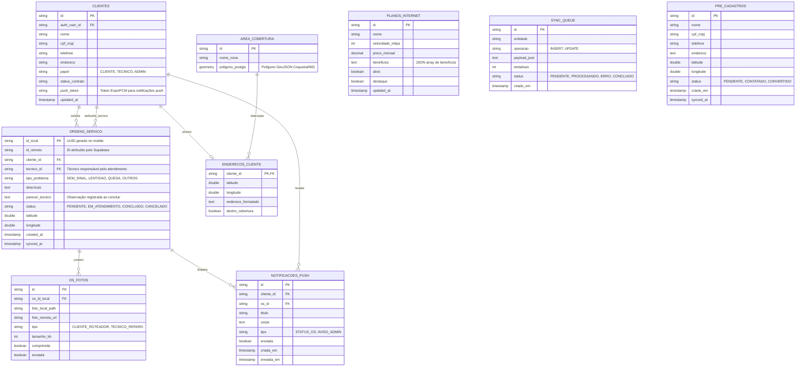

---

### 3.4 Modelo Local/Remoto e Políticas de RLS (Row Level Security)

#### 3.4.1 Mapeamento de Tabelas: SQLite (Local) vs Supabase Postgres (Remoto)

| Tabela Local (SQLite) | Tabela Remota (Supabase) | Sincroniza? | Direção | Observação |
|-----------------------|--------------------------|-------------|----------|------------|
| `clientes` | `public.clientes` | Sim | Bidirecional | Leitura local offline; escrita sobe via `sync_queue` |
| `ordens_servico` | `public.ordens_servico` | Sim | Mobile → Nuvem (INSERT) + Nuvem → Mobile (UPDATE status) | PK local = `id_local` (UUID); PK remota = `id` (UUID) |
| `os_fotos` | Bucket `os-fotos` + `public.os_fotos` | Sim | Mobile → Nuvem | Binário sobe para o Storage; URL remota gravada no SQLite |
| `planos_internet` | `public.planos_internet` | Sim | Nuvem → Mobile (somente leitura) | Atualizado pelo Admin; consumido público no login sem auth |
| `enderecos_cliente` | `public.clientes` (colunas lat/lng) | Sim | Bidirecional | Pode usar coluna geometry PostGIS na nuvem |
| `notificacoes` | `public.notificacoes_push` | Sim | Nuvem → Mobile | Gravado no SQLite local apenas para exibir histórico no app |
| `pre_cadastros` | `public.pre_cadastros` | Sim | Mobile → Nuvem | Visitante sem conta; sincroniza quando online |
| `sync_queue` | N/A | Não | Apenas Local | Fila efêmera — nunca sincronizada com a nuvem |
| `app_meta` | N/A | Não | Apenas Local | Guarda `last_sync_at` e flags. **Tokens JWT: exclusivamente no `expo-secure-store`** |

#### 3.4.2 Políticas de Row Level Security (RLS) por Tabela

> **Regra base**: Todas as tabelas no Supabase Postgres devem ter `ALTER TABLE ... ENABLE ROW LEVEL SECURITY` ativado. Nenhuma operação é permitida sem política explícita.

| Tabela | Operação | Papel Permitido | Condição RLS |
|--------|----------|----------------|---------------|
| `public.clientes` | `SELECT` | `cliente`, `tecnico`, `admin` | `auth.uid() = auth_user_id` (cliente vê só o próprio) / `admin` vê todos |
| `public.clientes` | `UPDATE` | `cliente`, `admin` | `auth.uid() = auth_user_id` (cliente atualiza só o próprio) |
| `public.clientes` | `INSERT` | `service_role` (via SyncService) | Apenas via backend autenticado com chave de serviço |
| `public.ordens_servico` | `SELECT` | `cliente` | `auth.uid() = (SELECT auth_user_id FROM clientes WHERE id = cliente_id)` |
| `public.ordens_servico` | `SELECT` | `tecnico` | `auth.uid() = (SELECT auth_user_id FROM clientes WHERE id = tecnico_id)` |
| `public.ordens_servico` | `SELECT` | `admin` | `TRUE` (acesso irrestrito ao painel) |
| `public.ordens_servico` | `INSERT` | `cliente` | `auth.uid() = (SELECT auth_user_id FROM clientes WHERE id = cliente_id)` |
| `public.ordens_servico` | `UPDATE` | `tecnico` | Somente campos `status`, `parecer_tecnico`, `synced_at` quando `tecnico_id` bate com `auth.uid()` |
| `public.ordens_servico` | `UPDATE` | `admin` | `TRUE` (pode reatribuir técnico e cancelar) |
| `public.os_fotos` | `SELECT` | `cliente`, `tecnico`, `admin` | Herdado pelo `os_id` da OS que o usuário tem acesso |
| `public.os_fotos` | `INSERT` | `cliente`, `tecnico` | Restrito ao `os_id` de OSs que pertencem ao usuário |
| `public.planos_internet` | `SELECT` | **público (anon)** | `TRUE` — acessado sem autenticação na tela de login |
| `public.planos_internet` | `INSERT`, `UPDATE`, `DELETE` | `admin` | `(SELECT papel FROM clientes WHERE auth_user_id = auth.uid()) = 'admin'` |
| `public.notificacoes_push` | `SELECT` | `cliente` | `auth.uid() = (SELECT auth_user_id FROM clientes WHERE id = cliente_id)` |
| `public.notificacoes_push` | `INSERT` | `service_role` | Apenas via SyncService com chave de serviço (backend) |
| `public.pre_cadastros` | `INSERT` | **público (anon)** + `service_role` | `TRUE` — visitante não autenticado pode inserir; sync via `service_role` |
| `public.pre_cadastros` | `SELECT`, `UPDATE` | `admin` | `(SELECT papel FROM clientes WHERE auth_user_id = auth.uid()) = 'admin'` |
| `storage.os-fotos` (bucket) | `INSERT` | `cliente`, `tecnico` | Somente no caminho `os-fotos/{auth.uid()}/` |
| `storage.os-fotos` (bucket) | `SELECT` | `cliente`, `tecnico`, `admin` | Caminho começa com `os-fotos/{auth.uid()}/` ou papel = `admin` |

#### 3.4.3 Helper Function recomendada no Supabase

```sql
-- Função auxiliar reutilizável nas políticas RLS
CREATE OR REPLACE FUNCTION public.get_papel_usuario()
RETURNS TEXT AS $$
  SELECT papel FROM public.clientes WHERE auth_user_id = auth.uid() LIMIT 1;
$$ LANGUAGE sql SECURITY DEFINER STABLE;

-- Exemplo de uso em política:
-- CREATE POLICY "admin_tudo_ordens" ON public.ordens_servico
--   FOR ALL USING (public.get_papel_usuario() = 'admin');
```


---

### 3.5 Diagrama de Objetos (Instâncias em Tempo de Execução — UML Object Diagram)

O **Diagrama de Objetos** ilustra uma fotografia instantânea (*runtime snapshot*) do sistema em um momento de pico operacional da **CJnet Telecom**. Ele detalha os valores concretos dos atributos e os vínculos de relacionamento entre as instâncias dos três perfis de usuário (**Cliente**, **Técnico**, **Administrador**), a **Ordem de Serviço**, os **Anexos Fotográficos**, os itens da **Fila de Sincronização**, os **Planos de Internet** e as **Notificações Push**:

```mermaid
classDiagram
    class clienteJoao {
        id = "cli-uuid-101"
        authUserId = "auth-usr-01"
        nome = "João da Silva"
        cpfCnpj = "123.456.789-00"
        telefone = "(35) 99876-1234"
        endereco = "Rua Minas Gerais, 100 - Centro, Coqueiral/MG"
        papel = CLIENTE
        statusContrato = ATIVO
        pushToken = "ExponentPushToken[joao_coqueiral_abc123]"
    }

    class tecnicoCarlos {
        id = "tec-uuid-202"
        authUserId = "auth-usr-02"
        nome = "Carlos Reparo de Campo"
        cpfCnpj = "987.654.321-99"
        telefone = "(35) 98811-2233"
        papel = TECNICO
        statusContrato = ATIVO
    }

    class adminMaria {
        id = "adm-uuid-303"
        authUserId = "auth-usr-03"
        nome = "Maria Gestora da Rede"
        cpfCnpj = "555.444.333-22"
        telefone = "(35) 99100-4455"
        papel = ADMIN
        statusContrato = ATIVO
    }

    class planoFibra400 {
        id = "plano-uuid-400"
        nome = "Fibra Turbo 400 Mega"
        velocidadeMbps = 400
        precoMensal = 99.90
        beneficios = ["Wi-Fi 6 incluso", "Upload 200 Mbps", "Suporte prioritário local"]
        ativo = true
        destaque = true
    }

    class osSemSinal {
        idLocal = "os-local-uuid-777"
        idRemoto = "os-remoto-supabase-888"
        clienteId = "cli-uuid-101"
        tecnicoId = "tec-uuid-202"
        tipoProblema = SEM_SINAL
        descricao = "Roteador com luz LOS vermelha piscando desde ontem à noite"
        parecerTecnico = "Fibra drop conectorizada novamente no poste; sinal normalizado para -19dBm"
        status = EM_ATENDIMENTO
        latitude = -21.1834
        longitude = -45.4389
        createdAt = "2026-09-11T14:30:00Z"
        syncedAt = "2026-09-11T14:31:15Z"
    }

    class fotoDiagnosticoCliente {
        id = "foto-local-001"
        osId = "os-local-uuid-777"
        fotoLocalPath = "file:///storage/emulated/0/DCIM/cjnet/onu_los_vermelho.jpg"
        fotoRemotaUrl = "https://supabase.cjnet.com.br/storage/v1/object/public/os-fotos/auth-usr-01/onu_los_vermelho.jpg"
        tipo = CLIENTE_ROTEADOR
        tamanhoKb = 450
        comprimida = true
        enviada = true
    }

    class fotoComprovanteTecnico {
        id = "foto-local-002"
        osId = "os-local-uuid-777"
        fotoLocalPath = "file:///storage/emulated/0/DCIM/cjnet/power_meter_normalizado.jpg"
        fotoRemotaUrl = "https://supabase.cjnet.com.br/storage/v1/object/public/os-fotos/auth-usr-02/power_meter_normalizado.jpg"
        tipo = TECNICO_REPARO
        tamanhoKb = 680
        comprimida = true
        enviada = false
    }

    class itemFilaSync {
        id = "sync-queue-uuid-999"
        entidade = "ordem_servico"
        operacao = UPDATE
        payloadJson = "{\"status\":\"concluida\",\"parecer_tecnico\":\"Fibra drop reconectada...\"}"
        tentativas = 0
        status = PENDENTE
        criadoEm = "2026-09-11T15:45:00Z"
    }

    class notifPushOS {
        id = "notif-uuid-555"
        clienteId = "cli-uuid-101"
        osId = "os-remoto-supabase-888"
        titulo = "Técnico a Caminho! 🚗"
        corpo = "Carlos Reparo está em deslocamento para seu endereço em Coqueiral/MG."
        tipo = STATUS_OS
        enviada = true
        criadaEm = "2026-09-11T15:00:00Z"
        enviadaEm = "2026-09-11T15:00:05Z"
    }

    class enderecoJoao {
        clienteId = "cli-uuid-101"
        latitude = -21.1834
        longitude = -45.4389
        enderecoFormatado = "Rua Minas Gerais, 100 - Centro, Coqueiral/MG"
        dentroCobertura = true
    }

    clienteJoao "1" --> "1" enderecoJoao : possui
    clienteJoao "1" --> "1" osSemSinal : abriu_chamado
    tecnicoCarlos "1" --> "1" osSemSinal : atende_no_campo
    adminMaria ..> osSemSinal : distribuiu_e_atribuiu
    osSemSinal "1" *--> "1" fotoDiagnosticoCliente : anexo_diagnostico_cliente
    osSemSinal "1" *--> "1" fotoComprovanteTecnico : anexo_reparo_tecnico
    osSemSinal ..> itemFilaSync : enfileira_encerramento_offline
    osSemSinal ..> notifPushOS : originou_disparo
    clienteJoao "1" <-- "1" notifPushOS : recebe_no_smartphone
    planoFibra400 ..> clienteJoao : plano_contratado
```

#### Descrição do Cenário Representado no Diagrama de Objetos:
1. **Cliente (`clienteJoao`)**: Abre a OS `osSemSinal` pelo app de autoatendimento residencial em Coqueiral/MG, anexando a foto do roteador (`fotoDiagnosticoCliente`) com luz LOS vermelha (já comprimida para 450 KB e sincronizada).
2. **Administrador (`adminMaria`)**: No painel de gestão da **Aba do Administrador**, visualiza o chamado e o atribui ao técnico operacional `tecnicoCarlos`.
3. **Técnico (`tecnicoCarlos`)**: Na **Aba do Técnico**, assume o chamado, vai até a residência, realiza a troca do conector de fibra óptica, tira a foto de comprovação com o medidor de potência (`fotoComprovanteTecnico`) e registra o encerramento do atendimento.
4. **Fila Offline (`itemFilaSync`)**: Como o técnico atua em local com oscilação de sinal 4G, a conclusão do atendimento é registrada de imediato no SQLite local e inserida na `sync_queue` para envio em segundo plano assim que a conectividade for restaurada.
5. **Notificação Push (`notifPushOS`)**: O `SyncService` dispara via `PushService` o alerta no smartphone do cliente João confirmando o status do atendimento.
6. **Vitrine (`planoFibra400`)**: O plano contratado pelo cliente fica disponível também na vitrine pública da tela de login para qualquer visitante interessado.

---

## 4. Diagramas Comportamentais e Metodologia de Desenvolvimento

### 4.1 Diagramas de Estado do Sistema

Os diagramas de estado a seguir modelam as transições de ciclo de vida das entidades centrais da arquitetura do aplicativo **CJnet**.

#### 4.1.1 Diagrama de Estados: Ciclo de Vida da Ordem de Serviço (OS)

Modela todas as etapas de uma Ordem de Serviço, desde a abertura offline pelo cliente, passagem pelo painel do Administrador, atendimento em campo pelo Técnico até o encerramento e notificação push:

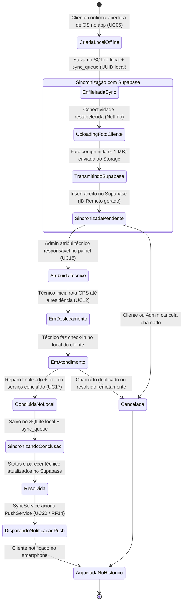

#### 4.1.2 Diagrama de Estados: Item da Fila de Sincronização (`SyncQueueItem`)

Modela o processamento de resiliência e retentativas com backoff exponencial para operações offline:

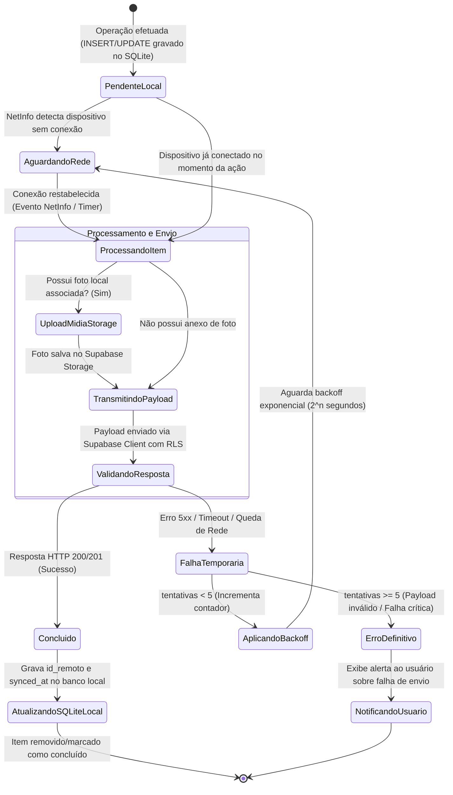

#### 4.1.3 Diagrama de Estados: Sessão e Controle de Acesso Baseado em Papéis (`AuthContext & RBAC`)

Modela a autenticação, segurança no `expo-secure-store` e o roteamento para as abas especializadas:

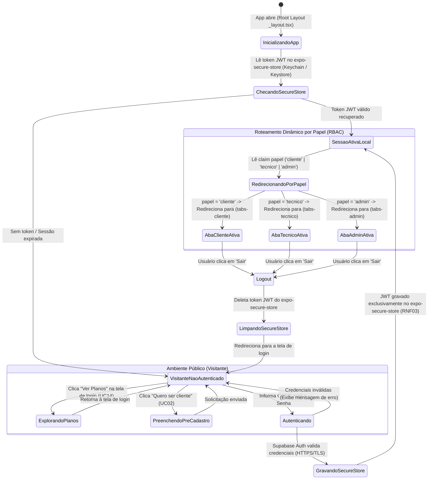

#### 4.1.4 Diagrama de Estados: Ciclo de Vida do Pré-Cadastro (`PreCadastro`)

Modela a captação de novos clientes a partir do aplicativo móvel:

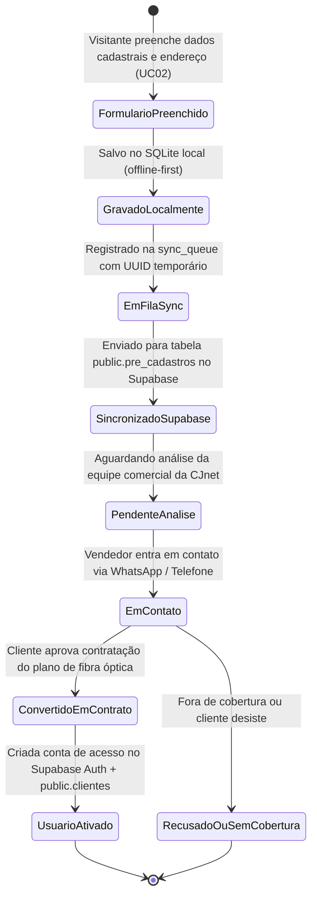

---

---

### 4.2 Metodologia TDD (Test-Driven Development) e Arquitetura em Camadas

A aplicação adota a metodologia **TDD** (*Test-Driven Development*), operando em um ciclo contínuo de **Red-Green-Refactor**. Esse processo garante a confiabilidade do código e o desacoplamento das regras de negócio através de camadas bem definidas na **Clean Architecture**:

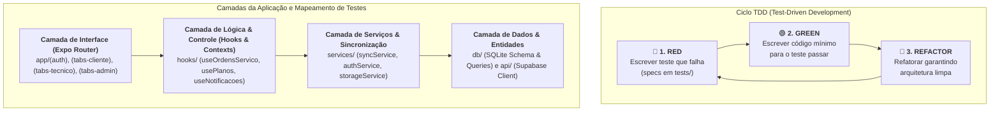

#### Aplicação do TDD no Projeto:
1. **Fase RED (Falha Inicial)**: Antes de implementar qualquer caso de uso (ex: abertura de OS offline ou consulta de planos), são desenvolvidos os testes unitários (`tests/domain/`, `tests/application/`) definindo o comportamento esperado das entidades e serviços.
2. **Fase GREEN (Aprovação Mínima)**: Implementa-se a regra de negócio com a quantidade mínima de código necessária para que a suíte de testes do Jest execute com 100% de aprovação.
3. **Fase REFACTOR (Refatoração Limpa)**: O código é organizado isolando responsabilidades entre `db/` (SQLite) e `api/` (Supabase), mantendo a garantia de que nenhuma regressão é introduzida.


---

### 4.3 Diagrama de Sequência: Abertura de OS Offline com Foto e Sync Assíncrono

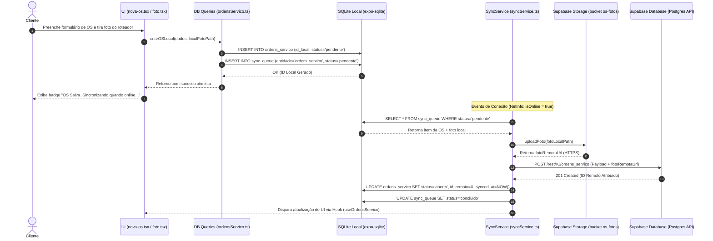

---

### 4.4 Diagrama de Atividades: Processamento da Fila de Sincronização (`syncService`)

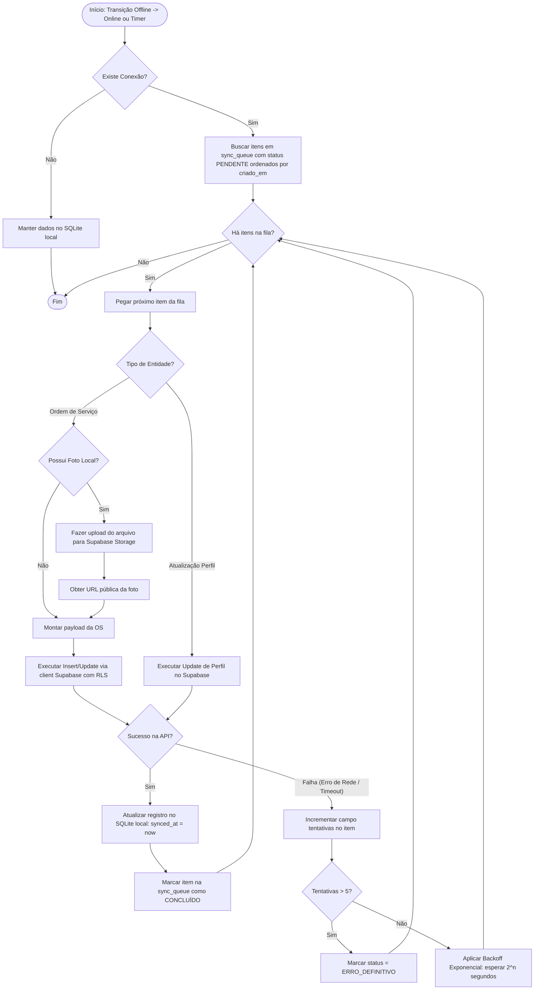

---

### 4.5 Diagrama de Componentes da Aplicação Mobile

```mermaid
componentDiagram
    package "Dispositivo Móvel (Expo React Native)" {
        [Expo Router (Stack & Tabs por Perfil)] as Router
        [Contextos Globais (Auth & Sync)] as Contexts
        [Custom Hooks (useOS, usePlanos)] as Hooks
        
        package "Camada de Dados Local" {
            [SQLite Client (expo-sqlite)] as SQLiteDB
            [Queries Locais (src/db/queries)] as DBQueries
        }

        package "Camada de Serviços" {
            [SyncService] as SyncSvc
            [StorageService] as StorageSvc
            [NetInfo Listener] as NetInfo
        }

        package "Camada de API Remota" {
            [Supabase JS Client] as SupabaseSDK
        }
    }

    cloud "Supabase Cloud PaaS" {
        [Supabase Auth (JWT + Roles)] as RemoteAuth
        [PostgreSQL + RLS + PostGIS] as RemoteDB
        [Supabase Storage Buckets] as RemoteStorage
    }

    Router --> Contexts
    Contexts --> Hooks
    Hooks --> DBQueries
    DBQueries --> SQLiteDB
    
    NetInfo --> SyncSvc
    SyncSvc --> DBQueries
    SyncSvc --> StorageSvc
    SyncSvc --> SupabaseSDK

    StorageSvc --> RemoteStorage
    SupabaseSDK --> RemoteAuth
    SupabaseSDK --> RemoteDB
```

---

## 5. Diretrizes de Arquitetura e Implementação (DDD, Clean Arch & TDD)

### 5.1 Organização do Projeto (`src/`)

```
src/
├── app/                    # Rotas e Páginas (Expo Router com Guard por Papel)
│   ├── (auth)/             # Telas Públicas / Não Logadas
│   │   ├── login.tsx       # Tela de Login com atalho/botão "Ver Planos"
│   │   ├── planos.tsx      # Vitrine Pública de Planos de Fibra Óptica
│   │   ├── cadastro.tsx    # Formulário de pré-cadastro
│   │   └── esqueci-senha.tsx
│   ├── (app)/              # Telas Autenticadas (Redirecionamento dinâmico)
│   │   ├── (tabs-cliente)/ # ABA DO CLIENTE (inicio, suporte, mapa, perfil)
│   │   ├── (tabs-tecnico)/ # ABA DO TÉCNICO (minhas-os, rota-mapa, concluir-os)
│   │   └── (tabs-admin)/   # ABA DO ADMINISTRADOR (dashboard, gerir-os, planos, avisos)
│   └── _layout.tsx         # Root Layout (Gerencia Auth Guard e Role Routing)
├── db/                     # BANCO LOCAL (SQLite) - Isolar de Supabase!
│   ├── schema.ts           # Schema das tabelas SQLite (clientes, ordens_servico, planos, etc)
│   ├── migrations/         # Scripts de criação e alteração de tabelas
│   └── queries/            # Funções puras de CRUD SQLite (ordensServico.ts, planos.ts, clientes.ts)
├── api/                    # COMUNICAÇÃO REMOTA (Supabase) - Isolar de SQLite!
│   ├── supabaseClient.ts   # Instância inicializada do client Supabase
│   └── endpoints/          # Funções HTTP/RPC (ordensServico.ts, planos.ts, auth.ts)
├── services/               # ORQUESTRADORES & SERVIÇOS DE REDE
│   ├── syncService.ts      # Consome db/ e api/ para sincronização bidirecional
│   ├── authService.ts      # Gerencia sessão, papéis de usuário (cliente/técnico/admin) e cache
│   └── storageService.ts   # Upload de fotos dos equipamentos e serviços
├── hooks/                  # HOOKS DE INTERFACE
│   ├── useNetworkStatus.ts # Escuta mudanças de conectividade via NetInfo
│   ├── useOrdensServico.ts # Interface reativa para abertura e gestão de OS
│   └── usePlanos.ts        # Consulta reativa da vitrine de planos de internet
├── components/             # COMPONENTES DE UI PURA
│   ├── ui/                 # Botões, cards, inputs, badges de status
│   └── domain/             # CardOS, CardPlanoInternet, DashboardAdminCard
├── context/                # CONTEXTOS DA APLICAÇÃO
│   ├── AuthContext.tsx     # Estado global de autenticação e papel (Role)
│   └── SyncContext.tsx     # Estado da fila de sincronização
└── utils/                  # Utilitários de moeda, datas e validação de CPF/CNPJ
```

> **Regra de Ouro da Arquitetura**:  
> - `src/db/` **NUNCA** importa nada de `src/api/`.  
> - `src/api/` **NUNCA** importa nada de `src/db/`.  
> - `src/services/` é a **única camada** autorizada a orquestrar as duas pontas.  
> - `src/components/` recebe propriedades puras de dados.

---

### 5.2 Contextos Delimitados (DDD - Domain Driven Design)

1. **Contexto de Autenticação & Gestão de Acessos**:
   - *Entidades*: `Cliente` (com `PapelUsuario`: Cliente, Técnico, Admin), `EnderecoCliente`.
   - *Regra*: Redirecionamento dinâmico da navegação conforme o papel do usuário logado.
2. **Contexto de Suporte & Ordem de Serviço (Cliente & Técnico)**:
   - *Entidades*: `OrdemServico`, `OSFoto`.
   - *Agregado*: `OrdemServico` atua como raiz do agregado contendo fotos do cliente (roteador) e do técnico (serviço concluído).
3. **Contexto Gerencial & Operacional (Administrador)**:
   - *Entidades*: `OrdemServico`, `PlanoInternet`, `NotificacaoPush`.
   - *Regra*: O Administrador gerencia e distribui chamados para os técnicos e envia notificações push para a base de assinantes.
4. **Contexto de Vitrine Comercial & Planos (Login / Público)**:
   - *Entidades*: `PlanoInternet`.
   - *Regra*: Exibição pública dos planos de fibra óptica na tela de login sem necessidade de autenticação.
5. **Contexto de Geolocalização & Cobertura**:
   - *Entidades*: `AreaCobertura` (GeoJSON / PostGIS).
   - *Regra*: Comparação client-side (offline) das coordenadas do cliente com o polígono delimitador de Coqueiral/MG.

---

### 5.3 Estratégia de Testes (TDD / Jest)

- **Testes Unitários de Banco Local (`src/db/queries/`)**:
  - Testar inserção de OS com status `pendente` e verificação da gravação idêntica em `sync_queue`.
  - Testar leitura offline da vitrine de planos de internet na tabela `planos_internet`.
- **Testes Unitários de Serviços (`src/services/syncService.ts`)**:
  - Mockar o `supabaseClient` e o `sqliteDb`.
  - Simular execução da fila com retentativa (backoff) após erro HTTP 500.
  - Verificar se a foto é enviada primeiro e se seu URL remoto é injetado no registro final da OS.
- **Testes de Integração de Telas (Expo Router)**:
  - Garantir que a troca de rota de `(auth)` para `(tabs-cliente)`, `(tabs-tecnico)` ou `(tabs-admin)` ocorra automaticamente de acordo com o `AuthContext` e o papel do usuário.


