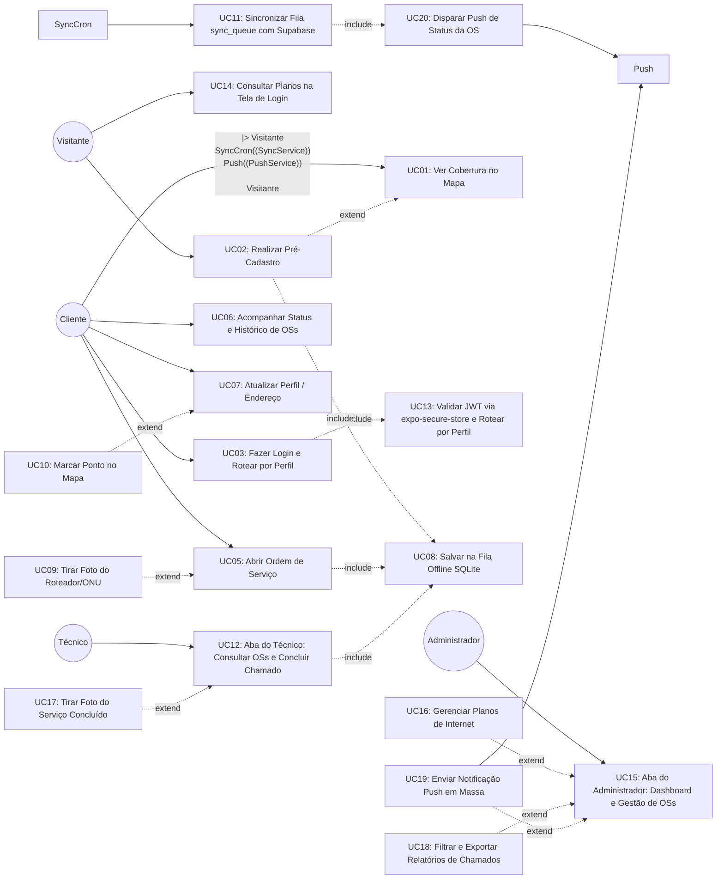
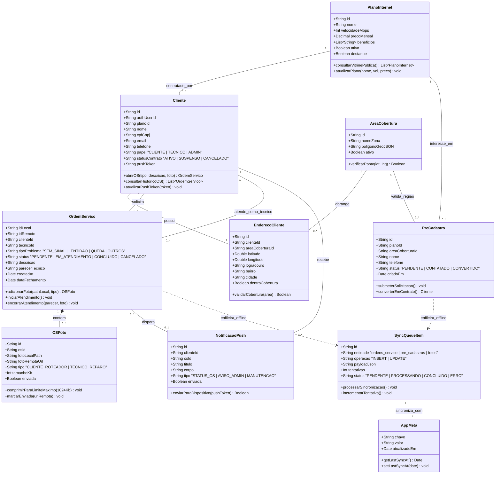
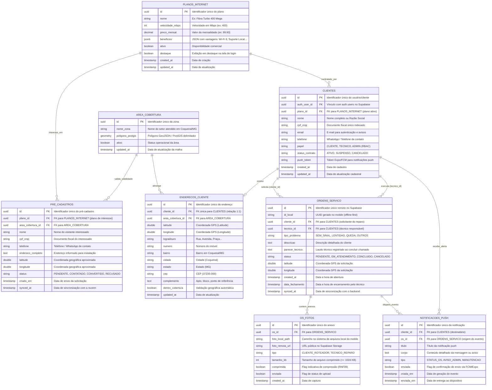
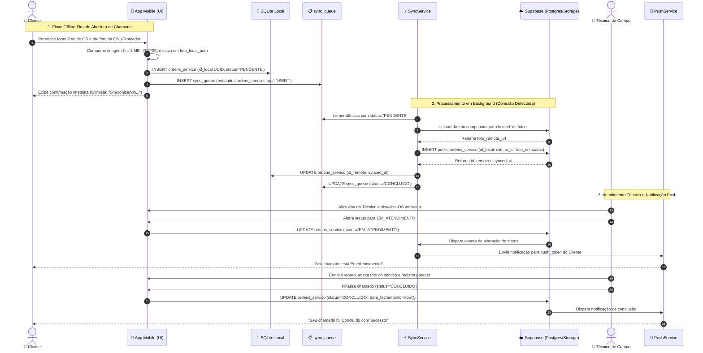
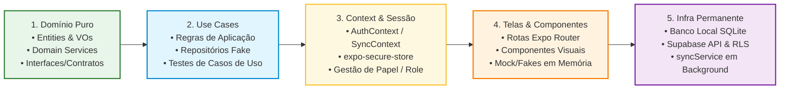
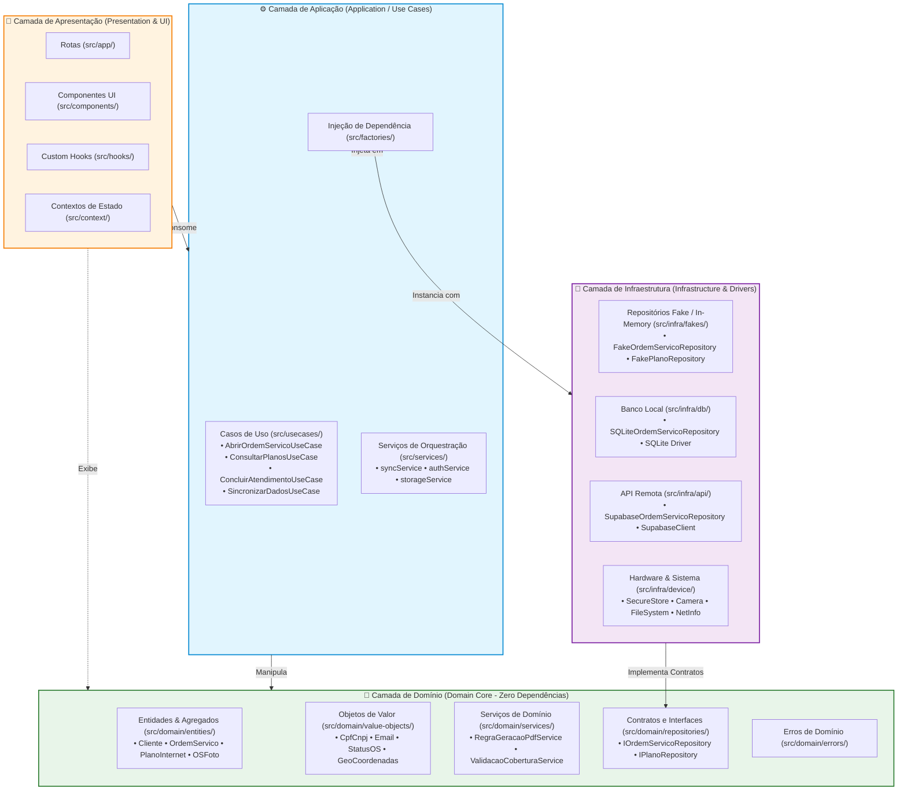

# Documento de Especificação e Design de Software — App CJnet

> **Projeto**: Canal Digital de Autoatendimento e Suporte Offline-First  
> **Empresa**: CJnet Provedor de Internet  
> **Localização**: Coqueiral/MG  
> **Metodologia**: DDD, Clean Architecture, TDD (Test-Driven Development), Offline-First (SQLite + Supabase)  
> **Padrão de Documentação**: `software-design-doc` (UML / Mermaid)

---

## 1. Visão Geral e Levantamento de Requisitos

O **App CJnet** é o aplicativo móvel oficial de autoatendimento da CJnet para clientes residenciais e comerciais de Coqueiral/MG e região. O aplicativo resolve a sobrecarga do atendimento telefônico e presencial ao permitir a abertura de chamadas/Ordens de Serviço (OS) com anexação de fotos de equipamentos (roteadores/ONUs), acompanhamento em tempo real do suporte, verificação de cobertura via geolocalização e consulta aos planos de internet. Por ser voltado para uma região com conectividade por vezes instável, o aplicativo adota arquitetura **Offline-First**, permitindo consulta de dados em cache local e filas de sincronização resilientes.

### 1.1 Árvore de Ideias do Projeto (Mapa Mental de Visão Geral)

A **Árvore de Ideias** sintetiza a visão macro do **App CJnet**, organizando os pilares estratégicos da aplicação e desdobrando suas funcionalidades principais e requisitos estruturais, incluindo os módulos de **Autoatendimento**, **Técnicos**, **Administradores** e **Visitantes (na Tela de Login)**:

```mermaid
graph TD
    Root["<b>App CJnet</b><br/>Canal Digital de Autoatendimento, Suporte & Gestão"]

    Root --> P1["📱 <b>Autoatendimento do Cliente</b>"]
    P1 --> P1_1["Autoatendimento de Chamados<br/>(Sem Sinal, Queda, Lentidão)"]
    P1 --> P1_2["Autodiagnóstico Visual<br/>(Anexo de Foto da ONU/Roteador)"]
    P1 --> P1_3["Acompanhamento do Status da OS<br/>em Tempo Real"]
    P1 --> P1_4["Autoatendimento de Cadastro<br/>& Atualização do Endereço"]

    Root --> P2["💳 <b>Vitrine de Planos (Tela de Login)</b>"]
    P2 --> P2_1["Acesso Livre sem Autenticação"]
    P2 --> P2_2["Consulta de Velocidades & Preços"]
    P2 --> P2_3["Benefícios do Plano & Solicitação"]

    Root --> P3["👷 <b>Aba do Técnico de Campo</b>"]
    P3 --> P3_1["Lista de OSs Atribuídas ao Técnico"]
    P3 --> P3_2["Navegação GPS / Endereço do Cliente"]
    P3 --> P3_3["Check-in, Resolução & Foto do Reparo"]

    Root --> P4["👑 <b>Aba do Administrador / Gestor</b>"]
    P4 --> P4_1["Dashboard Geral de Atendimentos & Métricas"]
    P4 --> P4_2["Distribuição / Atribuição de OSs"]
    P4 --> P4_3["Gestão de Planos & Disparo de Avisos"]

    Root --> P5["⚡ <b>Resiliência & Offline-First</b>"]
    P5 --> P5_1["Cache Local SQLite<br/>(Leitura 100% Offline)"]
    P5 --> P5_2["Fila Assíncrona sync_queue<br/>(UUIDs temporários)"]
    P5 --> P5_3["Sincronização Automática<br/>(Backoff Exponencial)"]

    Root --> P6["🗺️ <b>Geolocalização & Rede</b>"]
    P6 --> P6_1["Mapa Interativo da Região<br/>(Coqueiral/MG e Arredores)"]
    P6 --> P6_2["Verificação de Cobertura GeoJSON"]
    P6 --> P6_3["Validação do Ponto de Instalação"]

    Root --> P7["🔒 <b>Segurança & UX Perfilada</b>"]
    P7 --> P7_1["Autenticação por Perfil<br/>(Cliente / Técnico / Admin)"]
    P7 --> P7_2["Segurança Supabase RLS"]
    P7 --> P7_3["UI Intuitiva & Acessível"]
```



#### Descrição dos Pilares da Árvore de Ideias:
1. **Autoatendimento do Cliente**: Empodera o assinante para resolver instabilidades de conexão de forma autônoma, abrindo chamados sem passar por filas telefônicas, enviando fotos das luzes do roteador para autodiagnóstico e gerenciando seu perfil e localização.
2. **Vitrine de Planos (Tela de Login)**: Permite que visitantes e futuros assinantes cliquem na tela inicial/login para explorar os planos de fibra óptica disponíveis (velocidades, valores e vantagens) sem precisar estar autenticado.
3. **Aba do Técnico de Campo**: Módulo exclusivo com visão em lista/mapa das ordens de serviço atribuídas ao técnico, guiando sua rota de atendimento e registrando o encerramento do chamado com foto do serviço finalizado.
4. **Aba do Administrador / Gestor**: Painel centralizado para a gerência da CJnet controlar filas de suporte, atribuir chamados para técnicos em campo, cadastrar/alterar planos comercializados e emitir alertas e comunicados gerais para a base de clientes.
5. **Resiliência & Offline-First**: Assegura a operabilidade completa do app mesmo em locais com sinal de internet oscilante ou indisponível.
6. **Geolocalização & Rede**: Permite consultar disponibilidade técnica de fibra óptica e validações de endereço em tempo real no mapa.
7. **Segurança & UX Perfilada**: Garante controle de acesso baseado em papéis (RBAC/RLS) para proteger dados sensíveis de acordo com o perfil do usuário logado.


### 1.2 Tabela de Requisitos Funcionais (RF)

| ID | Descrição | Prioridade | Ator/Origem |
|----|-----------|-----------|-------------|
| **RF01** | O sistema deve permitir que o cliente realize login/autenticação vinculando seu CPF/CNPJ ou e-mail ao cadastro ativo na CJnet, com sessão armazenada de forma segura no dispositivo. | Alta | Cliente |
| **RF02** | O sistema deve permitir que visitantes realizem pré-cadastro informando nome, CPF/CNPJ, endereço e telefone para solicitação de contrato de internet. | Média | Visitante |
| **RF03** | O sistema deve redirecionar automaticamente o usuário autenticado para a aba correta conforme seu papel: cliente → aba-cliente, técnico → aba-técnico, administrador → aba-administrador. | Alta | Sistema (AuthService) |
| **RF04** | O sistema deve permitir a abertura de uma nova Ordem de Serviço (OS) informando o tipo de problema (ex: sem sinal, lentidão, queda) e descrição. | Alta | Cliente |
| **RF05** | O sistema deve permitir tirar foto do roteador/ONU através da câmera do dispositivo e anexá-la à Ordem de Serviço aberta. | Alta | Cliente |
| **RF06** | O sistema deve gravar a OS e a foto localmente no dispositivo (offline-first) atribuindo um ID temporário (UUID) e enfileirando para sincronização. | Alta | Sistema |
| **RF07** | O sistema deve exibir o status atualizado das Ordens de Serviço abertas (ex: Pendente, Em Atendimento, Concluída) e o histórico completo de chamados encerrados do cliente logado. | Alta | Cliente |
| **RF08** | O sistema deve exibir no mapa interativo se a localização do cliente ou endereço informado está dentro da área de cobertura GeoJSON da CJnet. | Média | Cliente / Visitante |
| **RF09** | O sistema deve permitir que o cliente consulte e atualize seus dados cadastrais e localização da sua residência no mapa. | Média | Cliente |
| **RF10** | O sistema deve sincronizar automaticamente as ações pendentes (`sync_queue`) em segundo plano assim que a conectividade for restabelecida. | Alta | Sistema (SyncService) |
| **RF11** | O sistema deve permitir que visitantes e clientes consultem os planos de internet da CJnet (velocidades, preços e benefícios) diretamente através de um botão/atalho na tela de login, sem necessidade de autenticação. | Média | Visitante / Cliente |
| **RF12** | O sistema deve disponibilizar a **Aba do Técnico**, exibindo as Ordens de Serviço atribuídas ao técnico logado, mapa de rota até a residência do cliente e registro de encerramento com foto do reparo efetuado. | Alta | Técnico |
| **RF13** | O sistema deve disponibilizar a **Aba do Administrador**, fornecendo painel gerencial com indicadores de OSs (pendentes, em andamento, concluídas), atribuição de técnicos a chamados, gestão de planos e envio de notificações em massa. | Alta | Administrador |
| **RF14** | O sistema deve enviar notificações push para os clientes quando o status de uma OS for alterado pelo técnico ou administrador (ex: "Seu chamado está em atendimento"). | Média | Sistema / Administrador |
| **RF15** | O sistema deve permitir que o administrador filtre, busque e exporte relatórios de chamados por período, bairro e técnico responsável, diretamente pelo painel da Aba do Administrador. | Baixa | Administrador |


### 1.3 Tabela de Requisitos Não Funcionais (RNF)

| ID | Categoria | Descrição + Critério Mensurável | Prioridade |
|----|-----------|----------------------------------|-------------|
| **RNF01** | **Disponibilidade / Offline** | O aplicativo deve manter funcionalidade de leitura (OSs existentes, perfil e mapa offline) 100% acessível sem conexão à internet. | Alta |
| **RNF02** | **Desempenho** | A consulta e gravação local no banco de dados SQLite deve responder em tempo < 100ms no dispositivo móvel. | Alta |
| **RNF03** | **Segurança de Rede e Dados** | Toda comunicação com a nuvem deve utilizar HTTPS/TLS; as tabelas no Supabase devem possuir políticas rígidas de **Row Level Security (RLS)** restritas ao `auth.uid()`; e os tokens JWT de sessão devem ser armazenados exclusivamente via **`expo-secure-store`** (Keychain iOS / Android Keystore), nunca em `AsyncStorage` ou SQLite. | Alta |
| **RNF04** | **Usabilidade** | A interface deve ser otimizada para telas de dispositivos Android e iOS com botões grandes, alto contraste e linguagem simples, acessível para usuários de diferentes faixas etárias de cidade do interior. | Alta |
| **RNF05** | **Manutenibilidade** | A arquitetura do código deve seguir **Clean Architecture / DDD / TDD**, isolando as regras de negócio puras na camada de domínio (`src/domain/`), completamente desacoplada do banco local SQLite (`src/infra/db/`) e da API remota Supabase (`src/infra/api/`). | Média |
| **RNF06** | **Confiabilidade** | O serviço de sincronização (`syncService`) deve implementar retentativas com backoff exponencial e garantir idempotência sem duplicação de chamados no backend. | Alta |
| **RNF07** | **Portabilidade** | O app deve ser construído sobre Expo (React Native) com suporte a navegação por arquivos (Expo Router) e suporte à execução universal em Android (mínimo API 26 / Android 8.0) e iOS (mínimo iOS 16). | Alta |
| **RNF08** | **Eficiência Energética** | A captura de geolocalização e fotos deve ser pontual, proibindo rastreamento de localização em segundo plano (*background location tracking*) para conservar bateria. | Média |
| **RNF09** | **Gestão de Mídia** | As fotos capturadas pelo cliente ou pelo técnico devem ser comprimidas para no máximo **1 MB** antes do upload para o Supabase Storage, garantindo desempenho adequado em conexões lentas (3G/4G de baixa intensidade). | Média |
| **RNF10** | **Controle de Acesso (RBAC)** | O sistema deve implementar controle de acesso baseado em papéis (*Role-Based Access Control*), garantindo que rotas, dados e funcionalidades da Aba do Técnico e da Aba do Administrador sejam completamente inacessíveis a usuários com papel `cliente`. | Alta |


---

## 2. Diagrama de Casos de Uso

### 2.1 Atores do Sistema
- **Cliente**: Usuário final cadastrado que utiliza o app para abrir Ordens de Serviço (OS), acompanhar o andamento e o histórico dos chamados e visualizar seu perfil.
- **Visitante / Não Logado**: Usuário que acessa o app para consultar a área de cobertura, explorar os **Planos de Internet** disponíveis na tela de login ou realizar pré-cadastro.
- **Técnico de Campo**: Usuário operacional da CJnet que acessa a **Aba do Técnico** para consultar a lista de OSs atribuídas a ele, navegar até o cliente e registrar o encerramento do chamado com foto do serviço prestado.
- **Administrador / Gestor**: Usuário gerencial da CJnet que acessa a **Aba do Administrador** para monitorar indicadores de suporte, atribuir ordens de serviço para técnicos, gerenciar planos de internet, filtrar relatórios e disparar notificações push em massa.
- **Supabase Auth / Postgres**: Sistema externo remoto de autenticação e banco de dados relacional.
- **SyncService (Cron/Event)**: Serviço em segundo plano que processa a fila local offline e dispara notificações push de status.
- **PushService**: Serviço de mensageria que entrega notificações push aos dispositivos dos clientes (ex: Expo Notifications / Firebase FCM).

### 2.2 Diagrama Mermaid de Casos de Uso



### 2.3 Especificação Textual dos Casos de Uso Principais

#### UC02: Realizar Pré-Cadastro
- **Ator Principal**: Visitante.
- **Pré-condição**: Nenhuma (acesso público).
- **Fluxo Principal**:
  1. O visitante acessa o app e na tela de login seleciona **"Quero ser cliente"**.
  2. O app exibe o formulário de pré-cadastro solicitando: nome completo, CPF/CNPJ, telefone e endereço.
  3. (Opcional) O visitante verifica a cobertura do endereço no mapa (`<<extend>> UC01`).
  4. O visitante confirma o envio. O app grava a solicitação no SQLite local e enfileira para envio ao Supabase (`<<include>> UC08`).
  5. O app exibe mensagem: **"Solicitação enviada! Nossa equipe entrará em contato."**
- **Fluxo Alternativo**:
  - *Offline*: O pré-cadastro fica salvo localmente e sincroniza quando a conexão for restabelecida.

#### UC03: Fazer Login e Rotear por Perfil
- **Ator Principal**: Cliente / Técnico / Administrador.
- **Pré-condição**: Nenhuma (tela de login).
- **Fluxo Principal**:
  1. O usuário informa e-mail (ou CPF) e senha na tela de login.
  2. O app autentica via Supabase Auth (HTTPS/TLS).
  3. Ao receber o token JWT, o app o salva de forma segura via **`expo-secure-store`** (Keychain/Android Keystore) — `<<include>> UC13`.
  4. O `authService` lê o campo `papel` do usuário (`cliente`, `tecnico` ou `admin`) e redireciona automaticamente:
     - `cliente` → **Aba do Cliente** `(tabs-cliente)`
     - `tecnico` → **Aba do Técnico** `(tabs-tecnico)`
     - `admin` → **Aba do Administrador** `(tabs-admin)`
- **Fluxo Alternativo**:
  - *Sessão cached*: Se já existe token válido no `expo-secure-store`, o usuário é redirecionado diretamente sem exibir o formulário de login.
  - *Credenciais inválidas*: O app exibe mensagem de erro e não salva nenhum dado.

#### UC05: Abrir Ordem de Serviço (OS)
- **Ator Principal**: Cliente.
- **Pré-condição**: Cliente logado ou com sessão em cache local.
- **Fluxo Principal**:
  1. O cliente navega até a aba `Suporte` e seleciona `Nova OS`.
  2. O cliente escolhe o tipo de problema (*Sem sinal*, *Lentidão*, *Queda constante*, *Mudança de endereço*).
  3. O cliente insere a descrição textual detalhada do problema.
  4. (Opcional) O cliente escolhe anexar foto (`<<extend>> UC09`).
  5. O cliente confirma o envio.
  6. O sistema gera um UUID local (`id_local`), grava na tabela local `ordens_servico` com `status = 'pendente'` e insere uma entrada na `sync_queue` (`<<include>> UC08`).
  7. A interface exibe a mensagem de sucesso otimista com um badge indicativo "Sincronizando...".
- **Fluxos Alternativos**:
  - *Dispositivo Online*: O `syncService` detecta a conexão e sincroniza imediatamente com o Supabase.
  - *Dispositivo Offline*: O OS fica em cache local até que a rede retorne.

#### UC06: Acompanhar Status e Histórico de OSs
- **Ator Principal**: Cliente.
- **Pré-condição**: Cliente logado.
- **Fluxo Principal**:
  1. O cliente acessa a aba `Meus Chamados`.
  2. O app exibe a lista de OSs **abertas** com badge de status em tempo real (Pendente, Em Atendimento).
  3. O cliente pode alternar para a aba **Histórico**, que lista todas as OSs com status `Concluída` ou `Cancelada`, com data de encerramento e observação do técnico.
  4. O cliente pode tocar em qualquer OS para ver os detalhes completos, incluindo a foto do reparo tirada pelo técnico.
- **Fluxo Alternativo**:
  - *Offline*: O app exibe os dados do cache SQLite local sem indicar atualização em tempo real.

#### UC09: Tirar Foto do Roteador/ONU (Ponto de Extensão em UC05)
- **Ator Principal**: Cliente.
- **Condição de Extensão**: Acionada quando o cliente clica em "Adicionar foto do equipamento" durante a abertura da OS.
- **Fluxo**:
  1. O app abre a câmera do dispositivo via `expo-image-picker`/`expo-camera`.
  2. O cliente tira a foto demonstrando os leds/luzes de status do equipamento.
  3. O app **comprime a imagem para no máximo 1 MB** antes de salvar (RNF09).
  4. O app salva o arquivo de imagem no armazenamento interno do app (`expo-file-system`) e grava o caminho local em `foto_local_path`.
  5. O upload binário para o Supabase Storage (`bucket: os-fotos`) é delegado para a fila de sincronização em segundo plano para não travar o envio do formulário textual.

#### UC12: Aba do Técnico — Atendimento e Encerramento de OS
- **Ator Principal**: Técnico de Campo.
- **Pré-condição**: Técnico autenticado no perfil `tecnico`.
- **Fluxo**:
  1. O técnico acessa a **Aba do Técnico** e visualiza a lista de Ordens de Serviço atribuídas ao seu usuário no dia.
  2. O técnico seleciona um chamado, abre a localização do cliente no mapa integrado e aciona a navegação GPS.
  3. Ao chegar no local, o técnico altera o status para `em_atendimento`.
  4. Após efetuar o reparo ou troca do roteador, o técnico registra a observação técnica, clica em "Concluir Atendimento" e tira a foto comprovando o serviço executado (`<<extend>> UC17`).
  5. O app salva os dados localmente e enfileira na `sync_queue` para sincronização com o Supabase (`<<include>> UC08`).
  6. Após a sincronização, o `SyncService` dispara a notificação push para o cliente informando a conclusão (`<<include>> UC20`).

#### UC14: Consultar Planos de Internet na Tela de Login
- **Ator Principal**: Visitante / Cliente.
- **Pré-condição**: Nenhuma (Acesso público na tela de boas-vindas/login).
- **Fluxo**:
  1. O usuário abre o aplicativo e, na tela de login, clica no botão ou card **"Conhecer Nossos Planos"**.
  2. O app carrega a lista de planos de fibra óptica disponíveis (com dados em cache local ou via Supabase em tempo real).
  3. O usuário visualiza velocidades (ex: 200 Mega, 400 Mega, 600 Mega), preços mensais e benefícios incluídos (Wi-Fi 6, suporte prioritário, etc.).
  4. O usuário pode clicar em **"Contratar / Solicitar Cobertura"**, sendo redirecionado para a checagem no mapa (`UC01`) ou tela de cadastro (`UC02`).

#### UC15: Aba do Administrador — Painel de Gestão e Notificações
- **Ator Principal**: Administrador / Gestor.
- **Pré-condição**: Usuário autenticado no perfil `admin`.
- **Fluxo**:
  1. O gestor acessa a **Aba do Administrador** e visualiza o dashboard com métricas de chamados (total abertos, tempo médio de atendimento, chamados pendentes por bairro de Coqueiral/MG).
  2. O gestor seleciona chamados pendentes e faz a atribuição direta para os técnicos de campo disponíveis.
  3. O gestor pode cadastrar novos planos de internet ou alterar valores/velocidades existentes (`<<extend>> UC16`), que atualizarão a vitrine da tela de login (`UC14`).
  4. O gestor pode criar e enviar um comunicado/aviso geral (ex: "Manutenção programada na rede da zona rural dia 10/09") para a base de clientes via notificação push no app (`<<extend>> UC19`).
  5. O gestor pode filtrar chamados por período, bairro ou técnico e exportar o relatório (`<<extend>> UC18`).

#### UC20: Disparar Notificação Push de Status da OS
- **Ator Principal**: Sistema (SyncService / PushService).
- **Pré-condição**: OS sincronizada com sucesso no Supabase e status alterado (`em_atendimento` ou `concluída`).
- **Fluxo**:
  1. Após confirmar o `INSERT`/`UPDATE` da OS no Supabase, o `SyncService` identifica a mudança de status.
  2. O sistema envia uma notificação push para o dispositivo do cliente vinculado à OS (ex: *"Seu chamado #1234 está Em Atendimento"*) via `PushService`.
  3. O cliente recebe a notificação no dispositivo, podendo tocar para abrir diretamente os detalhes da OS no app.


---

## 3. Diagrama de Classes de Domínio (UML)

O **Diagrama de Classes** modela a estrutura orientada a objetos das entidades centrais da regra de negócio do **App CJnet**, contendo atributos tipados, valores válidos para enumerações e métodos de negócio, com associações e composições totalmente integradas:



---

## 4. Diagrama Entidade-Relacionamento (DER Relacional)

O **Diagrama Entidade-Relacionamento (DER)** apresenta a modelagem relacional física do banco de dados no **Supabase Postgres (Remoto)** e o mapeamento das chaves primárias (PK), chaves estrangeiras (FK), tipos de dados e cardinalidades exatas do ecossistema **CJnet**:



---

## 5. Diagrama de Sequência (UML)

O **Diagrama de Sequência** detalha a troca de mensagens, fluxo assíncrono e etapas de processamento desde a abertura de uma Ordem de Serviço pelo cliente (mesmo offline), compressão da foto do equipamento, enfileiramento local, sincronização com o Supabase e notificação em tempo real:



---

## 6. Diagrama de Atividades (UML)

O **Diagrama de Atividades** ilustra o fluxo de trabalho operacional, decisões de captura de mídia, controle de conectividade de rede e o ciclo de vida completo da Ordem de Serviço no aplicativo:

```mermaid
flowchart TD
    Start([Início: Cliente identifica instabilidade na conexão]) --> OpenApp[Acessar App CJnet -> Aba Suporte]
    OpenApp --> FormOS[Preencher Tipo de Problema e Descrição]
    
    FormOS --> CheckFoto{Deseja anexar foto<br/>do equipamento?}
    CheckFoto -- Sim --> TakePic[Tirar foto da ONU/Roteador via Câmera]
    TakePic --> CompressPic[Comprimir foto para <= 1 MB - RNF09]
    CompressPic --> SaveLocalMedia[Salvar arquivo no storage interno do dispositivo]
    SaveLocalMedia --> SaveLocalDB
    CheckFoto -- Não --> SaveLocalDB

    SaveLocalDB[Gravar OS no SQLite com id_local UUID e status PENDENTE] --> EnqueueSync[Adicionar item na fila sync_queue]
    EnqueueSync --> FeedbackUI[Exibir feedback visual imediato ao Cliente]

    FeedbackUI --> NetCheck{Dispositivo com<br/>conexão ativa?}
    NetCheck -- Não --> OfflineState[Manter dados em cache local SQLite e aguardar rede]
    OfflineState --> NetCheck
    NetCheck -- Sim --> ProcessQueue[SyncService processa fila em background]

    ProcessQueue --> UploadStorage[Upload da foto comprimida para Supabase Storage]
    UploadStorage --> SyncPostgres[INSERT da OS na tabela public.ordens_servico]
    SyncPostgres --> UpdateQueueStatus[Marcar item como CONCLUIDO na sync_queue]

    UpdateQueueStatus --> AdminAssign[Admin / Sistema atribui OS ao Técnico na região]
    AdminAssign --> TechView[Técnico visualiza chamado na Aba do Técnico]
    TechView --> TechStart[Técnico inicia deslocamento e marca EM_ATENDIMENTO]
    TechStart --> Push1[SyncService envia Push: 'Chamado em Atendimento']

    Push1 --> TechRepair[Técnico realiza reparo no endereço do cliente]
    TechRepair --> TechPhoto[Técnico tira foto do serviço concluído e registra parecer]
    TechPhoto --> TechFinish[Técnico encerra atendimento: status CONCLUIDO]
    TechFinish --> Push2[SyncService envia Push: 'Chamado Concluído']
    Push2 --> EndNode([Fim: Histórico de chamados atualizado e sincronizado])
```



---

## 7. Modelo de Persistência, Banco Local SQLite e Políticas de Segurança (RLS)

### 7.1 Tabela de Persistência e Estratégia Mapeada

| Classe | Persistente? | Estratégia Local (SQLite) | Estratégia Remota (Supabase Postgres) | Observação |
|--------|-------------|----------------------------|----------------------------------------|------------|
| `Cliente` | Sim | Tabela `clientes` | Tabela `public.clientes` | FK `auth_user_id → auth.users`, FK `plano_id → planos_internet`, `papel`, `push_token` |
| `PlanoInternet` | Sim | Tabela `planos_internet` | Tabela `public.planos_internet` | Exibido na tela de login sem autenticação; gerenciado pelo Administrador |
| `AreaCobertura` | Sim | Tabela `area_cobertura` (cache GeoJSON) | Tabela `public.area_cobertura` (PostGIS) | Polígonos de cobertura da rede de fibra em Coqueiral/MG |
| `EnderecoCliente` | Sim | Tabela `enderecos_cliente` | Tabela `public.enderecos_cliente` | FK `cliente_id → clientes`, FK `area_cobertura_id → area_cobertura` |
| `OrdemServico` | Sim | Tabela `ordens_servico` (PK `id_local` UUID) | Tabela `public.ordens_servico` (PK `id` UUID) | FK `cliente_id`, FK `tecnico_id`, `parecer_tecnico`, `status` |
| `OSFoto` | Sim | Guardado em `foto_local_path` + flags locais | Bucket `os-fotos` + Tabela `public.os_fotos` | Comprimida $\le$ 1 MB (RNF09); FK `os_id → ordens_servico` |
| `PreCadastro` | Sim | Tabela `pre_cadastros` | Tabela `public.pre_cadastros` | FK `plano_id`, FK `area_cobertura_id`; sincroniza quando online |
| `NotificacaoPush` | Sim | Tabela `notificacoes` (cache local) | Tabela `public.notificacoes_push` | FK `cliente_id`, FK `os_id`; disparada pelo SyncService via PushService |
| `SyncQueueItem` | Sim (Apenas Local) | Tabela `sync_queue` | N/A (Fila efêmera no mobile) | Controla retentativas offline com backoff exponencial |
| `AppMeta` | Sim (Apenas Local) | Tabela `app_meta` | N/A | Guarda `last_sync_at` e flags de configuração. **Tokens JWT ficam exclusivamente no `expo-secure-store`** (RNF03) — nunca nesta tabela. |

---

### 7.2 Modelo Físico Local (SQLite Mobile)

#### 7.2.1 Tabelas Exclusivas do Banco Local SQLite (`expo-sqlite`)

Além de manter cópias em cache local das tabelas remotas para leitura offline, o dispositivo móvel possui tabelas locais exclusivas para governança da resiliência:

1. **`SYNC_QUEUE` (Fila Assíncrona de Sincronização)**:
   - `id` (TEXT PK — UUID): Identificador da pendência local.
   - `entidade` (TEXT): Entidade afetada (`ordem_servico`, `pre_cadastro`, `cliente`, `os_foto`).
   - `operacao` (TEXT): Tipo da operação (`INSERT`, `UPDATE`).
   - `payload_json` (TEXT): Dados completos serializados para envio.
   - `tentativas` (INTEGER DEFAULT 0): Contador de retentativas com backoff exponencial ($2^n$ segundos).
   - `status` (TEXT): Status da pendência (`PENDENTE`, `PROCESSANDO`, `ERRO`, `CONCLUIDO`).
   - `criado_em` (TEXT): Timestamp de inclusão na fila.

2. **`APP_META` (Metadados da Aplicação)**:
   - `chave` (TEXT PK): Identificador da configuração (ex: `last_sync_at`, `offline_mode`).
   - `valor` (TEXT): Valor associado.
   - `atualizado_em` (TEXT): Timestamp da última atualização.
   - *Nota de Segurança*: **Tokens JWT de sessão nunca são gravados nesta tabela**, ficando armazenados com isolamento de hardware exclusivamente no **`expo-secure-store`** (RNF03).

---

### 7.3 Mapeamento de Tabelas: SQLite (Local) vs Supabase Postgres (Remoto)

| Tabela Local (SQLite) | Tabela Remota (Supabase) | Sincroniza? | Direção | Observação |
|-----------------------|--------------------------|-------------|----------|------------|
| `clientes` | `public.clientes` | Sim | Bidirecional | Leitura local offline; escrita sobe via `sync_queue` |
| `planos_internet` | `public.planos_internet` | Sim | Nuvem → Mobile (somente leitura) | Atualizado pelo Administrador; consultado público na tela de login |
| `area_cobertura` | `public.area_cobertura` | Sim | Nuvem → Mobile (cache GeoJSON) | Polígonos de fibra para checagem client-side no mapa |
| `enderecos_cliente` | `public.enderecos_cliente` | Sim | Bidirecional | Armazena geolocalização e endereço residencial |
| `ordens_servico` | `public.ordens_servico` | Sim | Mobile → Nuvem (INSERT) + Nuvem → Mobile (UPDATE status) | PK local = `id_local` (UUID); PK remota = `id` (UUID) |
| `os_fotos` | Bucket `os-fotos` + `public.os_fotos` | Sim | Mobile → Nuvem | Imagem comprimida sobe para o Storage; metadados no Postgres |
| `pre_cadastros` | `public.pre_cadastros` | Sim | Mobile → Nuvem | Visitante sem conta; sincroniza quando online |
| `notificacoes` | `public.notificacoes_push` | Sim | Nuvem → Mobile | Histórico de alertas e avisos recebidos no app |
| `sync_queue` | N/A | Não | Apenas Local | Fila efêmera no mobile com retry e backoff |
| `app_meta` | N/A | Não | Apenas Local | Metadados de cache; **Tokens JWT: exclusivamente no `expo-secure-store`** |

---

### 7.4 Políticas de Row Level Security (RLS) por Tabela

> **Regra base**: Todas as tabelas no Supabase Postgres possuem `ALTER TABLE ... ENABLE ROW LEVEL SECURITY` ativado. Nenhuma leitura ou escrita ocorre sem política explícita.

| Tabela | Operação | Papel Permitido | Condição RLS |
|--------|----------|----------------|---------------|
| `public.clientes` | `SELECT` | `cliente`, `tecnico`, `admin` | `auth.uid() = auth_user_id` (cliente/técnico vê o próprio) / `admin` vê todos |
| `public.clientes` | `UPDATE` | `cliente`, `admin` | `auth.uid() = auth_user_id` (cliente atualiza o próprio perfil) |
| `public.clientes` | `INSERT` | `service_role` | Criação de contas via backend/serviço autenticado |
| `public.planos_internet` | `SELECT` | **público (anon)** | `TRUE` — acessado livremente na tela de login sem autenticação |
| `public.planos_internet` | `INSERT`, `UPDATE`, `DELETE` | `admin` | `(SELECT papel FROM clientes WHERE auth_user_id = auth.uid()) = 'admin'` |
| `public.area_cobertura` | `SELECT` | **público (anon)** + autenticados | `TRUE` — consulta pública de disponibilidade no mapa |
| `public.area_cobertura` | `INSERT`, `UPDATE`, `DELETE` | `admin` | `(SELECT papel FROM clientes WHERE auth_user_id = auth.uid()) = 'admin'` |
| `public.enderecos_cliente` | `SELECT`, `UPDATE` | `cliente`, `admin` | `auth.uid() = (SELECT auth_user_id FROM clientes WHERE id = cliente_id)` |
| `public.ordens_servico` | `SELECT` | `cliente` | `auth.uid() = (SELECT auth_user_id FROM clientes WHERE id = cliente_id)` |
| `public.ordens_servico` | `SELECT` | `tecnico` | `auth.uid() = (SELECT auth_user_id FROM clientes WHERE id = tecnico_id)` |
| `public.ordens_servico` | `SELECT` | `admin` | `TRUE` (visão geral do painel gerencial) |
| `public.ordens_servico` | `INSERT` | `cliente` | `auth.uid() = (SELECT auth_user_id FROM clientes WHERE id = cliente_id)` |
| `public.ordens_servico` | `UPDATE` | `tecnico` | Campos `status`, `parecer_tecnico`, `synced_at` quando `tecnico_id` bate com `auth.uid()` |
| `public.ordens_servico` | `UPDATE` | `admin` | `TRUE` (atribuição de técnico, cancelamento e reabertura) |
| `public.os_fotos` | `SELECT` | `cliente`, `tecnico`, `admin` | Herdado do `os_id` da OS que o usuário possui permissão |
| `public.os_fotos` | `INSERT` | `cliente`, `tecnico` | Restrito ao `os_id` das OSs vinculadas ao usuário |
| `public.pre_cadastros` | `INSERT` | **público (anon)** + `service_role` | `TRUE` — visitante não logado pode solicitar contrato |
| `public.pre_cadastros` | `SELECT`, `UPDATE` | `admin` | `(SELECT papel FROM clientes WHERE auth_user_id = auth.uid()) = 'admin'` |
| `public.notificacoes_push` | `SELECT` | `cliente` | `auth.uid() = (SELECT auth_user_id FROM clientes WHERE id = cliente_id)` |
| `public.notificacoes_push` | `INSERT` | `service_role` | Disparado apenas por serviços de backend autorizados |
| `storage.os-fotos` (bucket) | `INSERT` | `cliente`, `tecnico` | Somente no diretório `os-fotos/{auth.uid()}/` |
| `storage.os-fotos` (bucket) | `SELECT` | `cliente`, `tecnico`, `admin` | Caminho `os-fotos/{auth.uid()}/` ou papel = `admin` |

---

## 8. Diretrizes de Arquitetura e Implementação (DDD, Clean Architecture & TDD)

### 8.1 Estratégia de Desenvolvimento Incremental e Desacoplado

Nesta etapa inicial, o desenvolvimento do **App CJnet** segue um fluxo estritamente incremental e desacoplado:

$$\mathbf{Domínio} \longrightarrow \mathbf{Use\ Cases} \longrightarrow \mathbf{Context\ API\ \&\ Sessão\ Segura} \longrightarrow \mathbf{Componentes/Telas\ com\ Fakes} \longrightarrow \mathbf{Persistência\ Permanente}$$

Todo o ciclo é validado com **TDD (Test-Driven Development)** antes que qualquer dado toque em um banco de dados permanente (SQLite local ou Supabase Postgres remoto).



#### Fases do Pipeline Incremental:
1. **Fase 1 — Camada de Domínio Puro (`src/domain/`)**: Criação das regras centrais em TypeScript 100% puro. Validação imediata com testes unitários em `tests/domain/` sem necessidade de mocks ou I/O.
2. **Fase 2 — Casos de Uso (`src/usecases/`)**: Implementação da orquestração do sistema consumindo apenas entidades de domínio e interfaces abstratas. Validação com repositórios em memória (*Fakes*) em `tests/application/`.
3. **Fase 3 — Context API e Sessão Segura (`src/context/`, `src/services/authService.ts`)**: Centralização do estado global de autenticação e papel do usuário (`cliente`, `tecnico`, `admin`), integrando o armazenamento seguro de tokens via `expo-secure-store`.
4. **Fase 4 — Componentes e Telas com Fakes (`src/components/`, `src/app/`)**: Construção e navegação de todas as telas (Login, Vitrine de Planos, Aba do Cliente, Aba do Técnico e Aba do Administrador) alimentadas pelos use cases com dados simulados/fakes para validação visual e de fluxo.
5. **Fase 5 — Infraestrutura Permanente (`src/infra/db/` e `src/infra/api/`)**: Conexão com o banco local SQLite (`expo-sqlite`) e a API remota Supabase com suas respectivas migrações e políticas de segurança RLS, finalizando a sincronização resiliente (`syncService`).

---

### 8.2 Especificação da Camada de Domínio Puro (`src/domain/`)

O domínio contém as regras de negócio centrais e é **100% puro**, sem qualquer importação ou dependência do React, Expo, SQLite, Supabase ou bibliotecas de UI.

```
src/domain/
├── entities/           # Entidades e Raízes de Agregado (Entities & Aggregate Roots)
├── value-objects/      # Tipos imutáveis, sem identidade própria e validados na criação
├── services/           # Serviços de Domínio (Domain Services: regras cruzadas como RegraGeracaoPdfService)
├── repositories/       # Definição puramente declarativa das interfaces de repositórios
└── errors/             # Erros de Domínio Customizados
```

#### 1. Value Objects (Objetos de Valor)
Tipos imutáveis, sem identidade própria e validados no momento da criação:
- **`CpfCnpj`**: Encapsula a validação dos algoritmos de dígitos verificadores de CPF e CNPJ, impedindo a existência de clientes com documentos inválidos.
- **`Email`**: Valida a estrutura formal de e-mail através de expressões regulares estritas.
- **`StatusOS`**: Controla os estados válidos (`PENDENTE`, `EM_ATENDIMENTO`, `CONCLUIDO`, `CANCELADO`) e impede transições ilegais (ex: transitar de `CONCLUIDO` para `PENDENTE`).
- **`TipoProblema`**: Enum/VO tipado (`SEM_SINAL`, `LENTIDAO`, `QUEDA`, `OUTROS`).
- **`PapelUsuario`**: Controla os privilégios do usuário (`CLIENTE`, `TECNICO`, `ADMIN`).
- **`GeoCoordenadas`**: Encapsula `latitude` e `longitude`, fornecendo métodos puros para cálculo de distância e validação de limites geográficos.
- **`Preco` / `VelocidadeMbps`**: Encapsulam regras monetárias e de largura de banda sem dependência de formatação de UI.

#### 2. Entidades e Agregados (Entities & Aggregate Roots)
Modelos ricos que possuem identidade própria contínua (`id`), estado mutável controlado e métodos que garantem as invariantes de negócio:
- **`OrdemServico` (Aggregate Root)**: Atua como a raiz do agregado de suporte técnico. Controla a inclusão de fotos anexadas (`OSFoto`), transições de status, laudo técnico de fechamento e garante que uma OS não seja encerrada sem parecer técnico ou foto do reparo quando exigido.
- **`Cliente`**: Entidade que agrega dados cadastrais, endereço do ponto de instalação, histórico de contratos e pushToken do dispositivo.
- **`PlanoInternet`**: Entidade comercial contendo nome, velocidade em Mbps, preço mensal e lista de benefícios inclusos.
- **`OSFoto`**: Entidade de mídia anexada à OS. Valida que o tamanho da imagem não exceda o limite operacional de **1 MB (1024 KB)** antes da transmissão (RNF09).
- **`AreaCobertura`**: Entidade geográfica que encapsula a malha de atendimento da CJnet.
- **`PreCadastro`**: Entidade que representa solicitações de novos clientes interessados na contratação de planos.
- **`SyncQueueItem`**: Entidade que governa o estado e as regras de retentativa (backoff exponencial) da fila offline.

#### 3. Serviços de Domínio (Domain Services)
Lógicas de negócio puras que não pertencem naturalmente a uma única entidade ou que envolvem a interação entre múltiplos agregados:
- **`RegraGeracaoPdfService`**: Define a composição, regras de formatação, layout declarativo e estrutura de dados para emissão de Ordens de Serviço e laudos técnicos de atendimento em PDF (para assinatura e arquivo do cliente/provedor).
- **`ValidacaoCoberturaGeograficaService`**: Executa o algoritmo geométrico puro (*Ray-Casting*) para determinar se um par de coordenadas `(latitude, longitude)` está contido no polígono GeoJSON de uma `AreaCobertura` de Coqueiral/MG.
- **`CalculoViabilidadeInstalacaoService`**: Cruza a distância do ponto de instalação até a caixa de terminação óptica (CTO) mais próxima da CJnet para certificar viabilidade técnica.

#### 4. Contratos e Interfaces (Repository & Gateway Contracts)
Definição puramente declarativa das interfaces de repositórios e gateways de serviços externos (Inversão de Dependência - DIP):
- **`IOrdemServicoRepository`**: Métodos abstratos como `salvar(os)`, `buscarPorId(id)`, `listarPorCliente(clienteId)`, `listarPorTecnico(tecnicoId)`.
- **`IClienteRepository`**: Métodos `salvar(cliente)`, `buscarPorCpfCnpj(cpfCnpj)`, `buscarPorAuthId(authId)`.
- **`IPlanoRepository`**: Métodos `listarAtivos()`, `salvar(plano)`.
- **`ISyncQueueRepository`**: Métodos `enfileirar(item)`, `obterPendentes()`, `marcarConcluido(id)`.
- **`IPushNotificationGateway`**: Contrato declarativo para disparo de alertas.
- **`IPdfGeneratorGateway`**: Contrato declarativo para compilação física do documento PDF estruturado pelo `RegraGeracaoPdfService`.

---

### 8.3 Visão Geral e Camadas da Arquitetura (Clean Architecture & DDD)



---

### 8.4 Organização do Projeto e Disposição das Pastas (`src/`)

```
src/
├── domain/                     # 💎 CAMADA DE DOMÍNIO (Core do Negócio — Zero Dependências Externas)
│   ├── entities/               # Entidades e Raízes de Agregado
│   │   ├── Cliente.ts          # Assinante com papel, pushToken e contratos
│   │   ├── OrdemServico.ts     # Raiz de Agregado de chamados técnicos
│   │   ├── PlanoInternet.ts    # Planos de fibra óptica
│   │   ├── OSFoto.ts           # Anexo de foto (validação <= 1MB - RNF09)
│   │   ├── AreaCobertura.ts    # Delimitação geográfica
│   │   ├── EnderecoCliente.ts  # Endereço e geolocalização do ponto
│   │   ├── PreCadastro.ts      # Lead de pré-contratação
│   │   └── SyncQueueItem.ts    # Item da fila de sincronização
│   ├── value-objects/          # Objetos de Valor Imutáveis
│   │   ├── CpfCnpj.ts          # Validação matemática de CPF e CNPJ
│   │   ├── Email.ts            # Validação estrutural de e-mail
│   │   ├── StatusOS.ts         # PENDENTE | EM_ATENDIMENTO | CONCLUIDO | CANCELADO
│   │   ├── TipoProblema.ts     # SEM_SINAL | LENTIDAO | QUEDA | OUTROS
│   │   ├── PapelUsuario.ts     # CLIENTE | TECNICO | ADMIN
│   │   └── GeoCoordenadas.ts   # Latitude/Longitude com cálculo de distâncias
│   ├── services/               # Serviços de Domínio (Regras Cruzadas)
│   │   ├── RegraGeracaoPdfService.ts # Regras e estrutura para emissão de OS em PDF
│   │   └── ValidacaoCoberturaService.ts # Algoritmo de pertinência geográfica
│   ├── repositories/           # Interfaces e Contratos Declarativos de Repositórios
│   │   ├── IClienteRepository.ts
│   │   ├── IOrdemServicoRepository.ts
│   │   ├── IPlanoRepository.ts
│   │   ├── IAreaCoberturaRepository.ts
│   │   ├── IPreCadastroRepository.ts
│   │   └── ISyncQueueRepository.ts
│   └── errors/                 # Erros Customizados de Domínio
│       ├── DomainError.ts
│       ├── InvalidCpfError.ts
│       ├── InvalidStatusTransitionError.ts
│       └── FileSizeExceededError.ts
│
├── usecases/                   # ⚙️ CAMADA DE APLICAÇÃO (Casos de Uso do Sistema)
│   ├── ordens-servico/         # Casos de uso de suporte
│   │   ├── AbrirOrdemServicoUseCase.ts
│   │   ├── ListarOrdensServicoUseCase.ts
│   │   ├── IniciarAtendimentoUseCase.ts
│   │   └── ConcluirAtendimentoUseCase.ts
│   ├── planos/                 # Casos de uso da vitrine comercial
│   │   ├── ConsultarPlanosPublicosUseCase.ts
│   │   └── GerenciarPlanosUseCase.ts
│   ├── auth/                   # Casos de uso de autenticação e sessão
│   │   ├── AutenticarUsuarioUseCase.ts
│   │   └── ObterPerfilUsuarioUseCase.ts
│   └── sync/                   # Casos de uso de sincronização offline
│       └── SincronizarFilaUseCase.ts
│
├── infra/                      # 💾 CAMADA DE INFRAESTRUTURA (Implementações Técnicas)
│   ├── fakes/                  # Repositórios In-Memory para desenvolvimento desacoplado inicial
│   │   ├── FakeOrdemServicoRepository.ts
│   │   ├── FakePlanoRepository.ts
│   │   └── FakeClienteRepository.ts
│   ├── db/                     # Banco de Dados Local SQLite (expo-sqlite)
│   │   ├── schema.ts           # DDL das tabelas SQLite
│   │   ├── migrations/         # Scripts de migração locais
│   │   └── repositories/       # Repositórios SQLite concretos
│   │       ├── SQLiteOrdemServicoRepository.ts
│   │       └── SQLiteSyncQueueRepository.ts
│   ├── api/                    # Comunicação Remota Supabase
│   │   ├── supabaseClient.ts   # Instância do Supabase JS Client
│   │   └── repositories/       # Repositórios Supabase REST/RPC
│   │       ├── SupabaseOrdemServicoRepository.ts
│   │       └── SupabaseAuthRepository.ts
│   ├── storage/                # Gestão de Arquivos e Mídia
│   │   ├── LocalFileStorage.ts # expo-file-system
│   │   └── SupabaseFileStorage.ts # Supabase Storage (bucket 'os-fotos')
│   └── device/                 # Recursos Nativos do Dispositivo
│       ├── SecureKeyStorage.ts # expo-secure-store (JWT isolado - RNF03)
│       ├── ImageCompressor.ts  # Compressão de imagens para <= 1MB (RNF09)
│       └── NetworkInfo.ts      # Verificação de conectividade
│
├── factories/                  # 🏭 INJEÇÃO DE DEPENDÊNCIA
│   ├── makeOrdensServico.ts    # Injeta repositórios (Fakes ou Concretos) nos UseCases
│   ├── makePlanos.ts
│   ├── makeAuth.ts
│   └── makeSyncService.ts
│
├── services/                   # ⚡ SERVIÇOS E ORQUESTRADORES
│   ├── syncService.ts          # Processa a fila sync_queue com backoff exponencial
│   ├── authService.ts          # Gerencia credenciais no SecureStore e papel ativo
│   └── pushService.ts          # Gerenciamento de notificações push via Expo/FCM
│
├── app/                        # 📱 ROTAS E PÁGINAS (Expo Router — File-based Routing)
│   ├── (auth)/                 # Telas Públicas / Não Logadas
│   │   ├── login.tsx           # Tela de Login com atalho "Ver Planos"
│   │   ├── planos.tsx          # Vitrine Pública de Planos de Fibra Óptica
│   │   ├── cadastro.tsx        # Formulário de pré-cadastro
│   │   └── esqueci-senha.tsx
│   ├── (app)/                  # Telas Autenticadas (Protegidas por Guard de Papel)
│   │   ├── (tabs-cliente)/     # ABA DO CLIENTE (inicio, suporte, mapa, perfil)
│   │   ├── (tabs-tecnico)/     # ABA DO TÉCNICO (minhas-os, rota-mapa, concluir-os)
│   │   └── (tabs-admin)/       # ABA DO ADMINISTRADOR (dashboard, gerir-os, planos, avisos)
│   └── _layout.tsx             # Root Layout (Gerencia Contextos, Auth Guard e Role Routing)
│
├── components/                 # 🎨 COMPONENTES DE INTERFACE VISUAL
│   ├── ui/                     # Botões, inputs, badges, cards, modais genéricos
│   └── domain/                 # Componentes visuais conectados a conceitos do negócio
│       ├── CardOS.tsx          # Card de chamado com badge de status
│       ├── CardPlano.tsx       # Card de plano de internet com destaques
│       └── DashboardStats.tsx  # Métricas gerenciais para o administrador
│
├── hooks/                      # 🪝 HOOKS REATIVOS DE INTERFACE
│   ├── useNetworkStatus.ts     # Escuta estado da conexão de rede
│   ├── useOrdensServico.ts     # Interface reativa para os UseCases de OS
│   ├── usePlanos.ts            # Interface reativa para a vitrine de planos
│   └── useAuth.ts              # Acesso ao usuário autenticado e papel ativo
│
├── context/                    # 🌐 CONTEXTOS DE ESTADO GLOBAL
│   ├── AuthContext.tsx         # Estado de autenticação, papel (Role) e sessão segura
│   └── SyncContext.tsx         # Estado da sincronização e pendências offline
│
└── utils/                      # 🛠️ UTILITÁRIOS E HELPERS
    ├── formatters.ts           # Formatação de moeda (R$), data e Mbps
    ├── validators.ts           # Validações auxiliares de formulário
    └── constants.ts            # Cores do tema, URLs e constantes do app
```

---

### 8.5 Regras de Dependência da Arquitetura Limpa

```
[ Camada de Apresentação (app, components, hooks) ]
                     │
                     ▼
  [ Camada de Aplicação (usecases, services) ]
                     │
                     ▼
       [ Camada de Domínio (domain) ] ◄─── Zero Dependências Externas!
                     ▲
                     │
  [ Camada de Infraestrutura (infra: db, api, fakes) ] ── (Implementa Interfaces de Repositório do Domínio)
```

- **Regra 1 (`domain`)**: A camada de domínio não depende de nenhuma outra camada. Não possui dependências do React, Expo, SQLite ou Supabase.
- **Regra 2 (`usecases`)**: Dependem unicamente de `domain`. Interagem com bancos e APIs exclusivamente através das interfaces `domain/repositories/`.
- **Regra 3 (`infra`)**: Conhece `domain` (para implementar as interfaces de repositório e mapear entidades), mas `domain` nunca conhece `infra`.
- **Regra 4 (`app` / `components`)**: A interface visual consome casos de uso (`usecases`) ou hooks que orquestram os casos de uso, nunca acessando o SQLite ou Supabase diretamente.
- **Regra 5 (`db` vs `api`)**: `src/infra/db/` **NUNCA** importa nada de `src/infra/api/` e vice-versa. A sincronização e orquestração entre ambos é responsabilidade exclusiva de `src/services/syncService.ts` e dos casos de uso em `src/usecases/sync/`.

---

### 8.6 Contextos Delimitados (DDD - Domain-Driven Design)

1. **Contexto de Autenticação & Gestão de Acessos**:
   - *Entidades*: `Cliente` (com `PapelUsuario`: `CLIENTE`, `TECNICO`, `ADMIN`), `EnderecoCliente`.
   - *Regra*: Redirecionamento dinâmico da navegação conforme o papel do usuário logado.
2. **Contexto de Suporte & Ordem de Serviço (Cliente & Técnico)**:
   - *Entidades*: `OrdemServico`, `OSFoto`.
   - *Agregado*: `OrdemServico` atua como raiz do agregado contendo fotos do cliente (roteador) e do técnico (serviço concluído).
3. **Contexto Gerencial & Operacional (Administrador)**:
   - *Entidades*: `OrdemServico`, `PlanoInternet`, `NotificacaoPush`.
   - *Regra*: O Administrador gerencia e distribui chamados para os técnicos e envia notificações push para a base de assinantes.
4. **Contexto de Vitrine Comercial & Planos (Login / Público)**:
   - *Entidades*: `PlanoInternet`.
   - *Regra*: Exibição pública dos planos de fibra óptica na tela de login sem necessidade de autenticação.
5. **Contexto de Geolocalização & Cobertura**:
   - *Entidades*: `AreaCobertura` (GeoJSON / PostGIS).
   - *Regra*: Comparação client-side (offline) das coordenadas do cliente com o polígono delimitador de Coqueiral/MG via `ValidacaoCoberturaService`.

---

### 8.7 Metodologia TDD (Test-Driven Development) e Estratégia de Testes

A aplicação adota a metodologia **TDD** (*Test-Driven Development*), operando em um ciclo contínuo de **Red-Green-Refactor**, com testes organizados espelhando a arquitetura limpa e o pipeline incremental:

```
tests/
├── domain/                     # 1. Testes Unitários de Domínio Puro (Sem mocks, execução instantânea)
│   ├── Cliente.test.ts         # Valida criação, mudança de status e atualização de pushToken
│   ├── OrdemServico.test.ts    # Valida regras de transição de status e anexo de fotos
│   ├── OSFoto.test.ts          # Valida regras de compressão (<= 1MB - RNF09)
│   ├── CpfCnpj.test.ts         # Valida algoritmo de dígitos verificadores
│   ├── RegraGeracaoPdf.test.ts # Valida composição e regras do layout do PDF
│   └── PlanoInternet.test.ts   # Valida dados da vitrine pública
│
├── application/                # 2. Testes Unitários de Casos de Uso (com Repositórios Fake / In-Memory)
│   ├── AbrirOrdemServico.test.ts
│   ├── ConsultarPlanos.test.ts
│   ├── ConcluirAtendimento.test.ts
│   └── SincronizarFila.test.ts # Valida retentativas e idempotência
│
└── infra/                      # 3. Testes de Integração de Infraestrutura Permanente
    ├── SQLiteRepositories.test.ts # Valida gravação local e sync_queue
    └── SupabaseRepositories.test.ts # Valida mapeamento de DTOs e RLS
```

#### Ciclo TDD Aplicado ao App:
1. **RED (Falha Inicial)**: Escreve-se o teste unitário em `tests/domain/` ou `tests/application/` definindo a expectativa da regra de negócio (ex: *lançar `FileSizeExceededError` se a foto tiver mais de 1024 KB* ou *rejeitar fechamento de OS sem parecer técnico*). O teste falha.
2. **GREEN (Aprovação Mínima)**: Implementa-se a regra na entidade `src/domain/entities/OSFoto.ts` ou serviço `src/domain/services/` com o código estritamente necessário para o teste passar.
3. **REFACTOR (Refatoração Limpa)**: O código é otimizado e isolado conforme os princípios SOLID e Clean Architecture, mantendo 100% de cobertura nos testes antes de qualquer conexão com banco de dados permanente.


