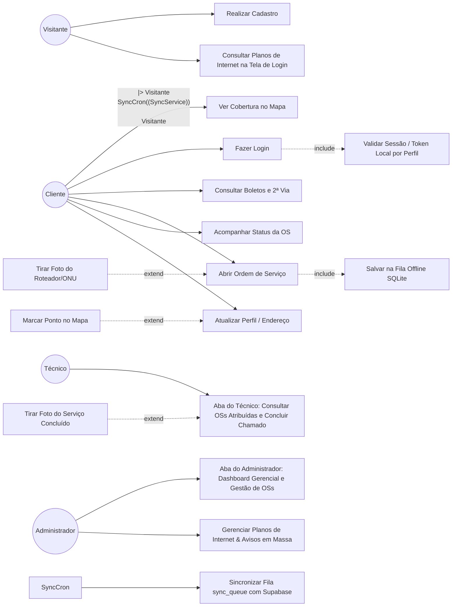
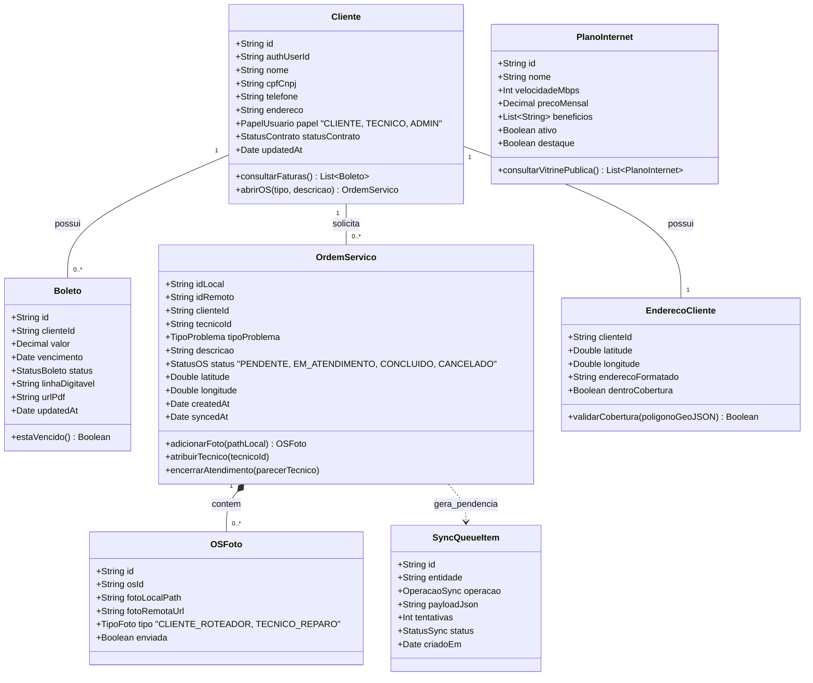
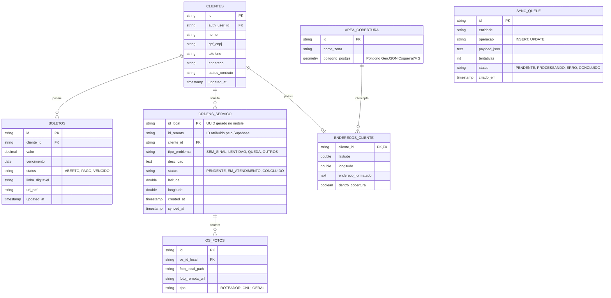
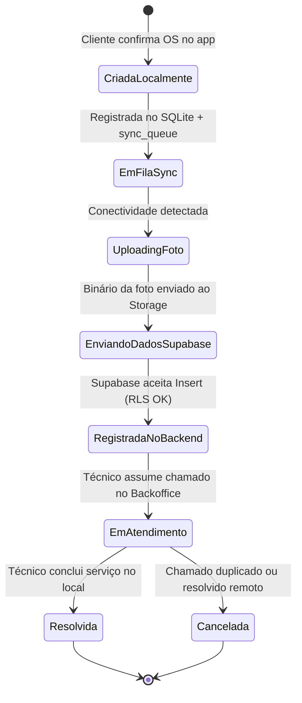
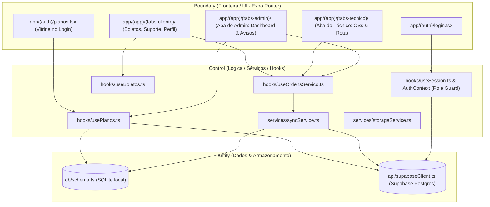
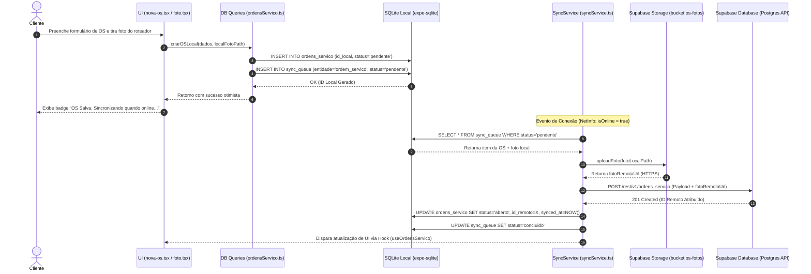

# Documento de Especificação e Design de Software — App CJnet

> **Projeto**: Canal Digital de Autoatendimento e Suporte Offline-First  
> **Empresa**: CJnet Provedor de Internet  
> **Localização**: Coqueiral/MG  
> **Metodologia**: DDD, Clean Architecture, Pattern BCE, Offline-First (SQLite + Supabase)  
> **Padrão de Documentação**: `software-design-doc` (UML / Mermaid)

---

## 1. Visão Geral e Levantamento de Requisitos

O **App CJnet** é o aplicativo móvel oficial de autoatendimento da CJnet para clientes residenciais e comerciais de Coqueiral/MG e região. O aplicativo resolve a sobrecarga do atendimento telefônico e presencial ao permitir consulta de faturas/2ª via de boletos, abertura de chamadas/Ordens de Serviço (OS) com anexação de fotos de equipamentos (roteadores/ONUs), acompanhamento em tempo real do suporte e verificação de cobertura via geolocalização. Por ser voltado para uma região com conectividade por vezes instável, o aplicativo adota arquitetura **Offline-First**, permitindo consulta de dados em cache local e filas de sincronização resilientes.

### 1.1 Árvore de Ideias do Projeto (Mapa Mental de Visão Geral)

A **Árvore de Ideias** sintetiza a visão macro do **App CJnet**, organizando os pilares estratégicos da aplicação e desdobrando suas funcionalidades principais e requisitos estruturais, incluindo os módulos específicos para **Clientes**, **Técnicos**, **Administradores** e **Visitantes (na Tela de Login)**:

```mermaid
graph TD
    Root["<b>App CJnet</b><br/>Canal Digital de Autoatendimento, Suporte & Gestão"]

    Root --> P1["💰 <b>Autoatendimento & Financeiro (Cliente)</b>"]
    P1 --> P1_1["Consultar Boletos<br/>(Em aberto, Pagos, Vencidos)"]
    P1 --> P1_2["Gerar 2ª Via em PDF<br/>& Visualização"]
    P1 --> P1_3["Cópia Rápida de Linha Digitável"]

    Root --> P2["🛠️ <b>Suporte Técnico & OS (Cliente)</b>"]
    P2 --> P2_1["Abertura de Chamados<br/>(Sem Sinal, Queda, Lentidão)"]
    P2 --> P2_2["Anexo de Fotos dos Equipamentos<br/>(Câmera / Galeria)"]
    P2 --> P2_3["Acompanhamento do Status da OS<br/>em Tempo Real"]

    Root --> P3["💳 <b>Vitrine de Planos (Tela de Login)</b>"]
    P3 --> P3_1["Acesso Livre sem Autenticação"]
    P3 --> P3_2["Consulta de Velocidades & Preços"]
    P3 --> P3_3["Benefícios do Plano & Solicitação"]

    Root --> P4["👷 <b>Aba do Técnico de Campo</b>"]
    P4 --> P4_1["Lista de OSs Atribuídas ao Técnico"]
    P4 --> P4_2["Navegação GPS / Endereço do Cliente"]
    P4 --> P4_3["Check-in, Resolução & Foto do Reparo"]

    Root --> P5["👑 <b>Aba do Administrador / Gestor</b>"]
    P5 --> P5_1["Dashboard Geral de Atendimentos & Métricas"]
    P5 --> P5_2["Distribuição / Atribuição de OSs"]
    P5 --> P5_3["Gestão de Planos & Disparo de Avisos"]

    Root --> P6["⚡ <b>Resiliência & Offline-First</b>"]
    P6 --> P6_1["Cache Local SQLite<br/>(Leitura 100% Offline)"]
    P6 --> P6_2["Fila Assíncrona sync_queue<br/>(UUIDs temporários)"]
    P6 --> P6_3["Sincronização Automática<br/>(Backoff Exponencial)"]

    Root --> P7["🗺️ <b>Geolocalização & Rede</b>"]
    P7 --> P7_1["Mapa Interativo da Região<br/>(Coqueiral/MG e Arredores)"]
    P7 --> P7_2["Verificação de Cobertura GeoJSON"]
    P7 --> P7_3["Validação do Ponto de Instalação"]

    Root --> P8["🔒 <b>Segurança & UX Perfilada</b>"]
    P8 --> P8_1["Autenticação por Perfil<br/>(Cliente / Técnico / Admin)"]
    P8 --> P8_2["Segurança Supabase RLS"]
    P8 --> P8_3["UI Intuitiva & Acessível"]
```



#### Descrição dos Pilares da Árvore de Ideias:
1. **Autoatendimento & Financeiro (Cliente)**: Desafoga o atendimento presencial/telefônico, permitindo a gestão autônoma de pagamentos e boletos pelo cliente.
2. **Suporte Técnico & OS (Cliente)**: Agiliza o diagnóstico técnico e reduz visitas desnecessárias com o envio prévio de fotos das luzes/LEDs dos equipamentos.
3. **Vitrine de Planos (Tela de Login)**: Permite que visitantes e futuros assinantes cliquem na tela inicial/login para explorar os planos de fibra óptica disponíveis (velocidades, valores e vantagens) sem precisar estar autenticado.
4. **Aba do Técnico de Campo**: Módulo exclusivo com visão em lista/mapa das ordens de serviço atribuídas ao técnico, guiando sua rota de atendimento e registrando o encerramento do chamado com foto do serviço finalizado.
5. **Aba do Administrador / Gestor**: Painel centralizado para a gerência da CJnet controlar filas de suporte, atribuir chamados para técnicos em campo, cadastrar/alterar planos comercializados e emitir alertas e comunicados gerais para a base de clientes.
6. **Resiliência & Offline-First**: Assegura a operabilidade completa do app mesmo em locais com sinal de internet oscilante ou indisponível.
7. **Geolocalização & Rede**: Permite consultar disponibilidade técnica de fibra óptica e validações de endereço em tempo real no mapa.
8. **Segurança & UX Perfilada**: Garante controle de acesso baseado em papéis (RBAC/RLS) para proteger dados sensíveis de acordo com o perfil do usuário logado.

### 1.2 Tabela de Requisitos Funcionais (RF)

| ID | Descrição | Prioridade | Ator/Origem |
|----|-----------|-----------|-------------|
| **RF01** | O sistema deve permitir que o cliente realize login/autenticação vinculando seu CPF/CNPJ ou e-mail ao cadastro ativo na CJnet. | Alta | Cliente |
| **RF02** | O sistema deve listar boletos (em aberto, pagos e vencidos) sincronizados no dispositivo local. | Alta | Cliente |
| **RF03** | O sistema deve permitir a visualização de detalhes e a cópia da linha digitável / 2ª via em PDF de boletos quando houver conexão. | Média | Cliente |
| **RF04** | O sistema deve permitir a abertura de uma nova Ordem de Serviço (OS) informando o tipo de problema (ex: sem sinal, lentidão, queda) e descrição. | Alta | Cliente |
| **RF05** | O sistema deve permitir tirar foto do roteador/ONU através da câmera do dispositivo e anexá-la à Ordem de Serviço aberta. | Alta | Cliente |
| **RF06** | O sistema deve gravar a OS e a foto localmente no dispositivo (offline-first) atribuindo um ID temporário (UUID) e enfileirando para sincronização. | Alta | Sistema |
| **RF07** | O sistema deve exibir o status atualizado das Ordens de Serviço abertas (ex: Pendente, Em Atendimento, Concluída). | Alta | Cliente |
| **RF08** | O sistema deve exibir no mapa interativo se a localização do cliente ou endereço informado está dentro da área de cobertura GeoJSON da CJnet. | Média | Cliente / Visitante |
| **RF09** | O sistema deve permitir que o cliente consulte e atualize seus dados cadastrais e localização da sua residência no mapa. | Média | Cliente |
| **RF10** | O sistema deve sincronizar automaticamente as ações pendentes (`sync_queue`) em segundo plano assim que a conectividade for restabelecida. | Alta | Sistema (SyncService) |
| **RF11** | O sistema deve permitir que visitantes e clientes consultem os planos de internet da CJnet (velocidades, preços e benefícios) diretamente através de um botão/atalho na tela de login, sem necessidade de autenticação. | Média | Visitante / Cliente |
| **RF12** | O sistema deve disponibilizar a **Aba do Técnico**, exibindo as Ordens de Serviço atribuídas ao técnico logado, mapa de rota até a residência do cliente e registro de encerramento com foto do reparo efetuado. | Alta | Técnico |
| **RF13** | O sistema deve disponibilizar a **Aba do Administrador**, fornecendo painel gerencial com indicadores de OSs (pendentes, em andamento, concluídas), atribuição de técnicos a chamados, gestão de planos e envio de notificações em massa. | Alta | Administrador |


### 1.3 Tabela de Requisitos Não Funcionais (RNF)

| ID | Categoria | Descrição + Critério Mensurável | Prioridade |
|----|-----------|----------------------------------|-------------|
| **RNF01** | **Disponibilidade / Offline** | O aplicativo deve manter funcionalidade de leitura (boletos em cache, OSs existentes, perfil e mapa offline) 100% acessível sem conexão à internet. | Alta |
| **RNF02** | **Desempenho** | A consulta e gravação local no banco de dados SQLite deve responder em tempo < 100ms no dispositivo móvel. | Alta |
| **RNF03** | **Segurança** | Toda comunicação com a nuvem deve utilizar HTTPS/TLS e as tabelas no Supabase devem possuir políticas rígidas de **Row Level Security (RLS)** restritas ao `auth.uid()`. | Alta |
| **RNF04** | **Usabilidade** | A interface deve ser otimizada para telas de dispositivos Android e iOS com botões grandes, alto contraste e linguagem simples, acessível para usuários de diferentes faixas etárias de cidade do interior. | Alta |
| **RNF05** | **Manutenibilidade** | A arquitetura do código deve seguir **Clean Architecture / BCE**, isolando completamente a camada de banco de dados SQLite (`src/db/`) da camada de API remota Supabase (`src/api/`). | Média |
| **RNF06** | **Confiabilidade** | O serviço de sincronização (`syncService`) deve implementar retentativas com backoff exponencial e garantir idempotência sem duplicação de chamados no backend. | Alta |
| **RNF07** | **Portabilidade** | O app deve ser construído sobre Expo (React Native) com suporte a navegação por arquivos (Expo Router) e suporte a execução universal Android e iOS. | Alta |
| **RNF08** | **Eficiência Energética** | A captura de geolocalização e fotos deve ser pontual, proibindo rastreamento de localização em segundo plano (*background location tracking*) para conservar bateria. | Média |


---

## 2. Diagrama de Casos de Uso

### 2.1 Atores do Sistema
- **Cliente**: Usuário final cadastrado que utiliza o app para consultar boletos, abrir OS e visualizar seu perfil.
- **Visitante / Não Logado**: Usuário que acessa o app para consultar a área de cobertura, explorar os **Planos de Internet** disponíveis na tela de login ou realizar pré-cadastro.
- **Técnico de Campo**: Usuário operacional da CJnet que acessa a **Aba do Técnico** para consultar a lista de OSs atribuídas a ele, navegar até o cliente e registrar o encerramento do chamado com foto do serviço prestado.
- **Administrador / Gestor**: Usuário gerencial da CJnet que acessa a **Aba do Administrador** para monitorar indicadores de suporte no dashboard, atribuir ordens de serviço para técnicos, gerenciar os planos de internet oferecidos e disparar comunicados em massa para os clientes.
- **Supabase Auth / Postgres**: Sistema externo remoto de autenticação e banco de dados relacional.
- **SyncService (Cron/Event)**: Serviço em segundo plano que processa a fila local offline.

### 2.2 Diagrama Mermaid de Casos de Uso



### 2.3 Especificação Textual dos Casos de Uso Principais

#### UC05: Abrir Ordem de Serviço (OS)
- **Ator Principal**: Cliente.
- **Pré-condição**: Cliente logado ou com sessão em cache local.
- **Fluxo Principal**:
  1. O cliente navega até a aba `Suporte` e seleciona `Nova OS`.
  2. O cliente escolhe o tipo de problema (*Sem sinal*, *Lentidão*, *Queda constante*, *Mudança de endereço*).
  3. O cliente insere a descrição textual detalhada do problema.
  4. (Opcional) O cliente escolhe anexar foto (`<<extend>> UC09`).
  5. O cliente confirma o envio.
  6. O sistema gera um UUID local (`id_local`), grava na tabela local `ordens_servico` com `status = 'pendente'` e insere uma entrada na `sync_queue` (`<<include>> UC08`).
  7. A interface exibe a mensagem de sucesso otimista com um badge indicativo "Sincronizando...".
- **Fluxos Alternativos**:
  - *Dispositivo Online*: O `syncService` detecta a conexão e sincroniza imediatamente com o Supabase.
  - *Dispositivo Offline*: A OS fica em cache local até que a rede retorne.

#### UC09: Tirar Foto do Roteador/ONU (Ponto de Extensão em UC05)
- **Ator Principal**: Cliente.
- **Condição de Extensão**: Acionada quando o cliente clica em "Adicionar foto do equipamento" durante a abertura da OS.
- **Fluxo**:
  1. O app abre a câmera do dispositivo via `expo-image-picker`/`expo-camera`.
  2. O cliente tira a foto demonstrando os leds/luzes de status do equipamento.
  3. O app salva o arquivo de imagem no armazenamento interno do app (`expo-file-system`) e grava o caminho local em `foto_local_path`.
  4. O upload binário para o Supabase Storage (`bucket: os-fotos`) é delegado para a fila de sincronização em segundo plano para não travar o envio do formulário textual.

#### UC14: Consultar Planos de Internet na Tela de Login
- **Ator Principal**: Visitante / Cliente.
- **Pré-condição**: Nenhuma (Acesso público na tela de boas-vindas/login).
- **Fluxo**:
  1. O usuário abre o aplicativo e, na tela de login, clica no botão ou card **"Conhecer Nossos Planos"**.
  2. O app carrega a lista de planos de fibra óptica disponíveis (com dados em cache local ou via Supabase em tempo real).
  3. O usuário visualiza velocidades (ex: 200 Mega, 400 Mega, 600 Mega), preços mensais e benefícios incluídos (Wi-Fi 6, suporte prioritário, etc.).
  4. O usuário pode clicar em **"Contratar / Solicitar Cobertura"**, sendo redirecionado para a checagem no mapa (`UC01`) ou tela de cadastro (`UC02`).

#### UC12: Aba do Técnico — Atendimento e Encerramento de OS
- **Ator Principal**: Técnico de Campo.
- **Pré-condição**: Técnico autenticado no perfil `tecnico`.
- **Fluxo**:
  1. O técnico acessa a **Aba do Técnico** e visualiza a lista de Ordens de Serviço atribuídas ao seu usuário no dia.
  2. O técnico seleciona um chamado, abre a localização do cliente no mapa integrado e aciona a navegação GPS.
  3. Ao chegar no local, o técnico altera o status para `em_atendimento`.
  4. Após efetuar o reparo ou troca do roteador, o técnico registra a observação técnica, clica em "Concluir Atendimento" e tira a foto comprovando o serviço executado (`<<extend>> UC17`).
  5. O app salva os dados localmente e enfileira na `sync_queue` para sincronização com o Supabase.

#### UC15: Aba do Administrador — Painel de Gestão e Notificações
- **Ator Principal**: Administrador / Gestor.
- **Pré-condição**: Usuário autenticado no perfil `admin`.
- **Fluxo**:
  1. O gestor acessa a **Aba do Administrador** e visualiza o dashboard com métricas de chamados (total abertos, tempo médio de atendimento, chamados pendentes por bairro de Coqueiral/MG).
  2. O gestor seleciona chamados pendentes e faz a atribuição direta para os técnicos de campo disponíveis.
  3. O gestor pode cadastrar novos planos de internet ou alterar valores/velocidades existentes (que atualizarão a vitrine da tela de login `UC14`).
  4. O gestor pode criar e enviar um comunicado/aviso geral (ex: "Manutenção programada na rede da zona rural dia 10/09") para a base de clientes via notificação no app.


---

## 3. Diagrama de Classes e Estrutura de Dados

### 3.1 Diagrama de Classes de Domínio (UML)



### 3.2 Tabela de Persistência e Estratégia Mapeada

| Classe | Persistente? | Estratégia Local (SQLite) | Estratégia Remota (Supabase Postgres) | Observação |
|--------|-------------|----------------------------|----------------------------------------|------------|
| `Cliente` | Sim | Tabela `clientes` | Tabela `public.clientes` | FK `auth_user_id → auth.users`, inclui coluna `papel` |
| `PlanoInternet` | Sim | Tabela `planos_internet` | Tabela `public.planos_internet` | Exibido na tela de login; gerenciado pelo Admin |
| `Boleto` | Sim | Tabela `boletos` | Tabela `public.boletos` | Somente leitura no app móvel |
| `OrdemServico` | Sim | Tabela `ordens_servico` (PK `id_local` UUID) | Tabela `public.ordens_servico` (PK `id` BigInt/UUID) | Inclui `tecnico_id` para atribuição em campo |
| `OSFoto` | Sim | Guardado em `foto_local_path` | Bucket Supabase Storage `os-fotos` + Tabela `public.os_fotos` | Suporta foto inicial (cliente) e foto final (técnico) |
| `EnderecoCliente` | Sim | Tabela `enderecos_cliente` | Tabela `public.clientes` / `PostGIS` | Armazena coordenadas (Lat/Lng) |
| `SyncQueueItem` | Sim (Apenas Local) | Tabela `sync_queue` | N/A (Fila efêmera no mobile) | Controla retentativas offline |
| `AppMeta` | Sim (Apenas Local) | Tabela `app_meta` | N/A | Guarda `last_sync_at`, tokens e flags |


---

### 3.3 Diagrama Entidade-Relacionamento (DER Relacional)



---

## 4. Diagramas Complementares de Análise e Arquitetura

### 4.1 Diagrama de Estados: Ciclo de Vida da Ordem de Serviço (OS)



---

### 4.2 Arquitetura Boundary-Control-Entity (BCE)

A aplicação mapeia a especificação do projeto em 3 estereótipos bem definidos, direcionando a interface do usuário conforme seu perfil (Cliente, Técnico ou Administrador) ou modo visitante (Tela de Login com Planos):



---

### 4.3 Diagrama de Sequência: Abertura de OS Offline com Foto e Sync Assíncrono



---

### 4.4 Diagrama de Atividades: Processamento da Fila de Sincronização (`syncService`)


---

### 4.5 Diagrama de Componentes da Aplicação Mobile

```mermaid
componentDiagram
    package "Dispositivo Móvel (Expo React Native)" {
        [Expo Router (Stack & Tabs por Perfil)] as Router
        [Contextos Globais (Auth & Sync)] as Contexts
        [Custom Hooks (useBoletos, useOS, usePlanos)] as Hooks
        
        package "Camada de Dados Local" {
            [SQLite Client (expo-sqlite)] as SQLiteDB
            [Queries Locais (src/db/queries)] as DBQueries
        }

        package "Camada de Serviços" {
            [SyncService] as SyncSvc
            [StorageService] as StorageSvc
            [NetInfo Listener] as NetInfo
        }

        package "Camada de API Remota" {
            [Supabase JS Client] as SupabaseSDK
        }
    }

    cloud "Supabase Cloud PaaS" {
        [Supabase Auth (JWT + Roles)] as RemoteAuth
        [PostgreSQL + RLS + PostGIS] as RemoteDB
        [Supabase Storage Buckets] as RemoteStorage
    }

    Router --> Contexts
    Contexts --> Hooks
    Hooks --> DBQueries
    DBQueries --> SQLiteDB
    
    NetInfo --> SyncSvc
    SyncSvc --> DBQueries
    SyncSvc --> StorageSvc
    SyncSvc --> SupabaseSDK

    StorageSvc --> RemoteStorage
    SupabaseSDK --> RemoteAuth
    SupabaseSDK --> RemoteDB
```

---

## 5. Diretrizes de Arquitetura e Implementação (DDD, Clean Arch & TDD)

### 5.1 Organização do Projeto (`src/`)

```
src/
├── app/                    # Rotas e Páginas (Expo Router com Guard por Papel)
│   ├── (auth)/             # Telas Públicas / Não Logadas
│   │   ├── login.tsx       # Tela de Login com atalho/botão "Ver Planos"
│   │   ├── planos.tsx      # Vitrine Pública de Planos de Fibra Óptica
│   │   ├── cadastro.tsx    # Formulário de pré-cadastro
│   │   └── esqueci-senha.tsx
│   ├── (app)/              # Telas Autenticadas (Redirecionamento dinâmico)
│   │   ├── (tabs-cliente)/ # ABA DO CLIENTE (inicio, boletos, suporte, mapa, perfil)
│   │   ├── (tabs-tecnico)/ # ABA DO TÉCNICO (minhas-os, rota-mapa, concluir-os)
│   │   └── (tabs-admin)/   # ABA DO ADMINISTRADOR (dashboard, gerir-os, planos, avisos)
│   └── _layout.tsx         # Root Layout (Gerencia Auth Guard e Role Routing)
├── db/                     # BANCO LOCAL (SQLite) - Isolar de Supabase!
│   ├── schema.ts           # Schema das tabelas SQLite (clientes, ordens_servico, planos, etc)
│   ├── migrations/         # Scripts de criação e alteração de tabelas
│   └── queries/            # Funções puras de CRUD SQLite (boletos.ts, ordensServico.ts, planos.ts)
├── api/                    # COMUNICAÇÃO REMOTA (Supabase) - Isolar de SQLite!
│   ├── supabaseClient.ts   # Instância inicializada do client Supabase
│   └── endpoints/          # Funções HTTP/RPC (boletos.ts, ordensServico.ts, planos.ts, auth.ts)
├── services/               # ORQUESTRADORES & SERVIÇOS DE REDE
│   ├── syncService.ts      # Consome db/ e api/ para sincronização bidirecional
│   ├── authService.ts      # Gerencia sessão, papéis de usuário (cliente/técnico/admin) e cache
│   └── storageService.ts   # Upload de fotos dos equipamentos e serviços
├── hooks/                  # HOOKS DE INTERFACE
│   ├── useNetworkStatus.ts # Escuta mudanças de conectividade via NetInfo
│   ├── useBoletos.ts       # Retorna dados locais de faturas + sync
│   ├── useOrdensServico.ts # Interface reativa para abertura e gestão de OS
│   └── usePlanos.ts        # Consulta reativa da vitrine de planos de internet
├── components/             # COMPONENTES DE UI PURA
│   ├── ui/                 # Botões, cards, inputs, badges de status
│   └── domain/             # ItemBoleto, CardOS, CardPlanoInternet, DashboardAdminCard
├── context/                # CONTEXTOS DA APLICAÇÃO
│   ├── AuthContext.tsx     # Estado global de autenticação e papel (Role)
│   └── SyncContext.tsx     # Estado da fila de sincronização
└── utils/                  # Utilitários de moeda, datas e validação de CPF/CNPJ
```

> **Regra de Ouro da Arquitetura**:  
> - `src/db/` **NUNCA** importa nada de `src/api/`.  
> - `src/api/` **NUNCA** importa nada de `src/db/`.  
> - `src/services/` é a **única camada** autorizada a orquestrar as duas pontas.  
> - `src/components/` recebe propriedades puras de dados.

---

### 5.2 Contextos Delimitados (DDD - Domain Driven Design)

1. **Contexto de Autenticação & Gestão de Acessos**:
   - *Entidades*: `Cliente` (com `PapelUsuario`: Cliente, Técnico, Admin), `EnderecoCliente`.
   - *Regra*: Redirecionamento dinâmico da navegação conforme o papel do usuário logado.
2. **Contexto Financeiro**:
   - *Entidades*: `Boleto`.
   - *Regra*: Leitura offline do histórico de faturas; geração de 2ª via válida apenas online.
3. **Contexto de Suporte & Ordem de Serviço (Cliente & Técnico)**:
   - *Entidades*: `OrdemServico`, `OSFoto`.
   - *Agregado*: `OrdemServico` atua como raiz do agregado contendo fotos do cliente (roteador) e do técnico (serviço concluído).
4. **Contexto Gerencial & Operacional (Administrador)**:
   - *Entidades*: `OrdemServico`, `PlanoInternet`, `ComunicadoAviso`.
   - *Regra*: O Administrador gerencia e distribui chamados para os técnicos e publica avisos para a base de assinantes.
5. **Contexto de Vitrine Comercial & Planos (Login / Público)**:
   - *Entidades*: `PlanoInternet`.
   - *Regra*: Exibição pública dos planos de fibra óptica na tela de login sem necessidade de autenticação.
6. **Contexto de Geolocalização & Cobertura**:
   - *Entidades*: `AreaCobertura` (GeoJSON / PostGIS).
   - *Regra*: Comparação client-side (offline) das coordenadas do cliente com o polígono delimitador de Coqueiral/MG.

---

### 5.3 Estratégia de Testes (TDD / Jest)

- **Testes Unitários de Banco Local (`src/db/queries/`)**:
  - Testar inserção de OS com status `pendente` e verificação da gravação idêntica em `sync_queue`.
  - Testar leitura offline da vitrine de planos de internet na tabela `planos_internet`.
- **Testes Unitários de Serviços (`src/services/syncService.ts`)**:
  - Mockar o `supabaseClient` e o `sqliteDb`.
  - Simular execução da fila com retentativa (backoff) após erro HTTP 500.
  - Verificar se a foto é enviada primeiro e se seu URL remoto é injetado no registro final da OS.
- **Testes de Integração de Telas (Expo Router)**:
  - Garantir que a troca de rota de `(auth)` para `(tabs-cliente)`, `(tabs-tecnico)` ou `(tabs-admin)` ocorra automaticamente de acordo com o `AuthContext` e o papel do usuário.

